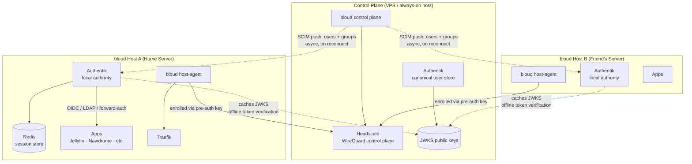
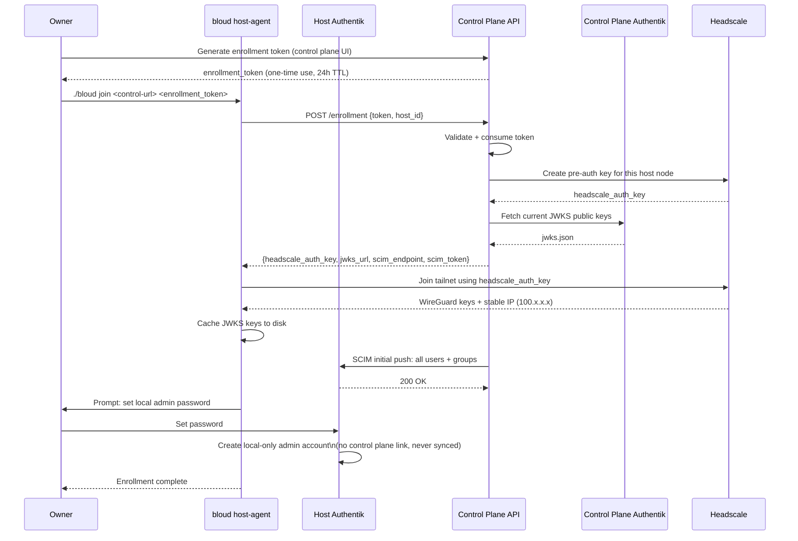
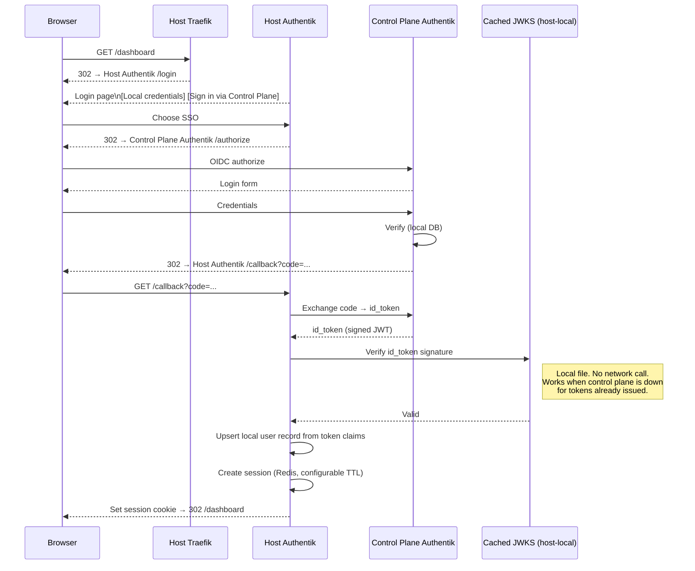
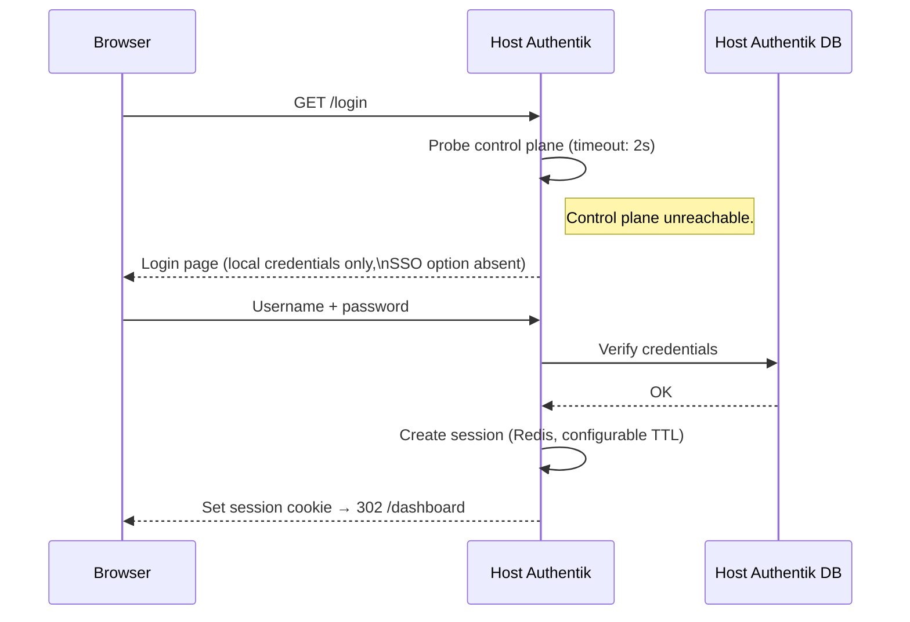
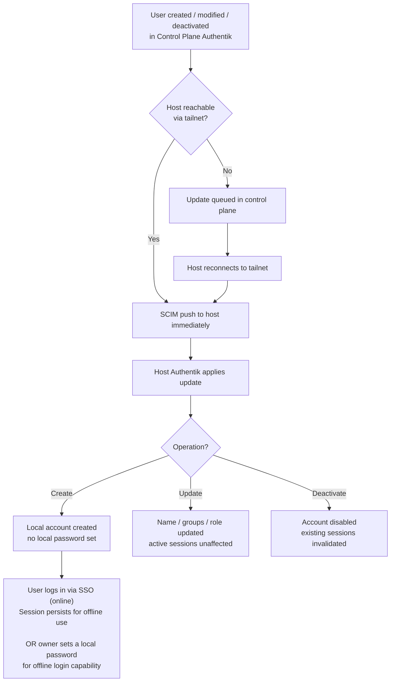
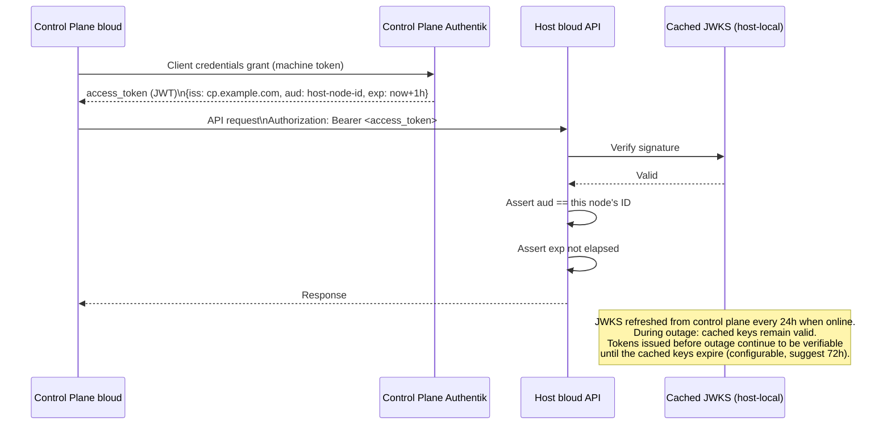
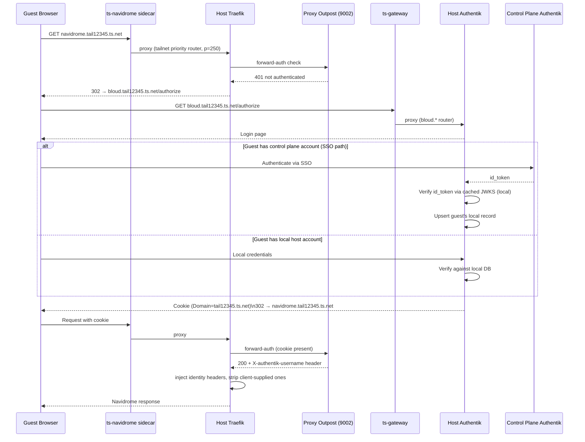

# Plan: Auth Federation — bloud + headscale Control Plane

> **Status: PROPOSED — not reviewed, not accepted, not aligned with product direction.**
> Do not implement from this document.

## Problem

Three identity tiers exist in the bloud + headscale control plane model:

1. **Control plane** — headscale SSO, fleet management, canonical user store
2. **Per-host bloud instances** — local app SSO (Jellyfin, Navidrome), web UI auth, tailnet sharing
3. **Guests** — remote users accessing shared apps via tailnet

The naive approach — host Authentik proxies all auth to the control plane — violates the
core constraint:

> **Local auth must work when the control plane is unreachable.**

Sync (replicating user records across Authentik instances) is also wrong: no clear
source of truth at runtime, revocation ambiguity, conflicts when instances diverge.

## Core Principles

1. **Host Authentik is the runtime authority.** It has its own user database. Sessions
   are local. Apps authenticate locally. Nothing in the auth hot path calls the control
   plane.

2. **Control plane is the provisioning authority.** It owns the canonical user store. It
   pushes user/group changes to hosts asynchronously. Hosts apply updates when connected;
   operate on last-known state when not.

3. **Provisioning is one-directional.** Control plane → hosts only. Hosts never push
   identity back. The control plane is the source of truth for who exists and what roles
   they have.

4. **JWKS caching enables offline token verification.** For inter-node API calls, hosts
   cache the control plane's JWKS public keys locally. Tokens issued by the control
   plane can be verified cryptographically without calling home.

5. **The local admin account is always local.** The bloud owner always has one account
   that exists purely in the host's Authentik — set during enrollment, with a password
   known only to them. No dependency on the control plane, ever.

---

## Architecture

The dashed arrows are async and non-blocking. If they fail, hosts continue operating
on their local state. Only solid arrows are in the runtime hot path.

---

## Enrollment Flow

A new bloud host joins the control plane. This is the only moment the control plane
is strictly required. After enrollment, the host is self-sufficient.

The local admin account is the permanent break-glass credential. It is never touched
by SCIM and does not exist in the control plane's user store.

---

## Login Flows

### Online: SSO via Control Plane

### Offline: Local Credentials

Control plane unreachable. No change in behavior for users with local passwords.
The SSO option is hidden; the login form works as normal.

This path covers:
- The local admin account (always works regardless of sync state)
- Any user whose account was SCIM-provisioned and who has set a local password

Users who have only ever logged in via SSO and whose session has expired cannot
log in during an outage. For home server use cases (1–5 users, owner + family),
a session TTL of 30 days makes this a non-issue in practice. The local admin
covers emergency access.

---

## User Provisioning (SCIM)

Users exist canonically in control plane Authentik. Hosts receive them via SCIM 2.0,
which Authentik supports natively on both sides (provider and consumer).

### What is and is not synced

| Synced (control plane → host) | Not synced |
|---|---|
| User accounts (email, display name) | Passwords |
| Group memberships | Sessions |
| Role assignments (admin / member) | App-level OIDC client records |
| Account active / inactive state | Local-only accounts |

Passwords are never synced. A user can independently set local credentials on each host
they have access to. For most users, the SSO path covers initial login and the session
TTL covers the rest — a local password is optional but available.

---

## Inter-node API Auth

When the control plane calls a managed host's API (config push, install trigger,
status query). Uses machine-to-machine JWT — no user session involved.

The `aud` (audience) claim is the node's stable headscale node ID. A token issued to
reach Host A cannot be replayed against Host B.

---

## Guest / Sharing Auth

Remote users accessing shared apps via tailnet. Integrates with PLAN-tailnet-outpost.md.
The standalone proxy outpost is the auth boundary; host Authentik is the identity provider.

The guest's SSO path uses the same JWKS verification that user logins use. If the
control plane is down, guests with local host accounts can still authenticate.
Guests who have only ever used SSO cannot log in fresh during a control plane outage —
the same trade-off as for regular users.

---

## Failure Mode Reference

| Scenario | Impact | Recovery |
|---|---|---|
| Control plane unreachable | SSO login unavailable. Existing sessions work. Local credentials work. SCIM sync paused. | Wait for recovery. Use local credentials or existing session. |
| Control plane unreachable + session expired | SSO login unavailable. Local credentials work for users with local passwords. | Local admin always works. Users without local passwords wait for control plane. |
| Host Authentik down | All host UI auth and app auth fails. | Restart host Authentik. Local admin recovers access to bloud UI once Authentik is up. |
| JWKS cache expired during outage | Control plane Bearer tokens cannot be verified by host. Host-to-app auth unaffected. | On reconnect, host refreshes JWKS immediately. Suggest 72h JWKS cache TTL to cover extended outages. |
| SCIM sync missed (host offline at user creation) | New user account absent from host. | Incremental sync runs on reconnect. Control plane queues missed events. |
| Host loses tailnet connectivity | Tailnet-shared apps unreachable to guests. Local access fully unaffected. | WireGuard reconnects automatically. Re-enroll only if node keys are lost. |
| Control plane permanently lost | No new enrollments. No new users. SSO path permanently down. | Hosts operate indefinitely on last-known state. New users must be created locally. |

---

## Implementation Phases

### Phase 1: Local admin + local auth baseline

- Enrollment creates a local-only admin account in host Authentik
- Loopback bypass remains for CLI access (`_cli` pseudo-user)
- No control plane component exists yet
- **Validates**: local auth is fully independent; no regressions

### Phase 2: Control plane enrollment

- `./bloud join <url> <token>` command
- Control plane generates enrollment token (one-time, 24h)
- On enrollment: control plane issues headscale pre-auth key, host joins tailnet
- JWKS endpoint published by control plane Authentik; cached by host on enrollment
- **Validates**: inter-node network connectivity; JWKS cache written and read correctly

### Phase 3: Inter-node API auth

- Control plane Authentik configured with a machine client (client credentials flow)
- Host API validates Bearer tokens using cached JWKS; checks `aud` against node ID
- Control plane can now call host APIs without user sessions
- **Validates**: secure machine-to-machine calls; `aud` enforcement prevents token replay

### Phase 4: SCIM user sync

- Control plane Authentik configured as SCIM provider
- Host Authentik configured as SCIM consumer (SCIM source)
- Initial push on enrollment; incremental sync on reconnect + periodic background poll
- **Validates**: user accounts appear on hosts without manual duplication; deactivation propagates

### Phase 5: SSO login path

- Host Authentik configured with control plane Authentik as OIDC source
- Login page shows "Sign in via Control Plane" option alongside local credentials
- `id_token` verified locally via cached JWKS — no network call to control plane
- Local user record upserted from token claims on first SSO login
- **Validates**: single password works across control plane UI and host (when online); falls back cleanly to local when offline

### Phase 6: Guest sharing auth

- Standalone proxy outpost running on host (PLAN-tailnet-outpost.md)
- Guest login through host Authentik; SSO path available via control plane
- Cookie scoped to tailnet domain
- **Validates**: remote guests can access shared apps with proper auth; local auth fallback works for guests with host accounts
