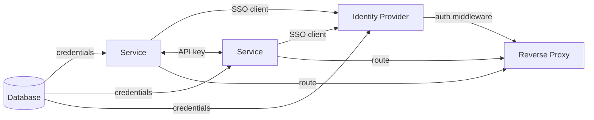

# Bloud

**Home Cloud Integration Platform**

[](LICENSE)
[]()

> **Status:** Early alpha. Core infrastructure and web UI working.
>
> **Architecture direction:** The current implementation runs as a NixOS appliance. The
> first release target is a portable Bloud binary installed on Debian, while preserving the
> dashboard, same-origin app experience, dependency graph, configurators, and shared login.
> See [SPEC.md](SPEC.md), [Portable Runtime Architecture](docs/portable-runtime-architecture.md),
> and [Integration and Reconciliation Architecture](docs/integration-reconciliation.md).

---

Self-hosting's hard part isn't installation. Every platform has solved that. The hard part is  when you add a second service and realize the first one doesn't know it exists.

To connect two services manually, you typically:

- Generate an API key in one service
- Open the second service's settings, paste the key
- Create an OAuth client in your identity provider - client ID, secret, callback URL
- Paste those back into the first service
- Register the second service with the identity provider separately
- Write a reverse proxy rule for each
- Provision and wire a database for each
- Remember all of this when you reinstall or migrate

On every other platform, *you* are the integration layer — the person who knows which credentials go where and how the pieces fit together. You don't configure services. You configure the relationships between services. That knowledge lives in your head, not in the platform.

**Bloud flips this.** Apps declare what they provide and what they consume. The system holds the integration knowledge and wires everything automatically - on install, on restart, forever.



Every edge in this graph is a manual step on every other platform. Bloud generates all of them and regenerates them correctly every time a service starts.

---

## The Vision

- Install Bloud on a supported Linux server
- Access the web dashboard and install supported apps with one click
- Automatically maintain SSO, routing, credentials, databases, and app-to-app connections
- Reconcile integrations safely after dependency changes, failures, upgrades, and reboot

---

## Current Development Quick Start

The current development implementation runs as a bootable NixOS ISO. It remains the
reference runtime while the portable Debian runtime is built.

For **development**, you'll need a NixOS machine (see [Local Development](#local-development) below).

```bash
git clone https://codeberg.org/d-buckner/bloud.git
cd bloud
npm run setup    # Install deps, build CLI
./bloud setup    # Check prerequisites, apply NixOS config
./bloud start    # Start dev environment
```

Access the web UI at **http://bloud.local** (port 80, through Traefik).

---

## Current App Catalog

| Category           | Apps                                  |
| ------------------ | ------------------------------------- |
| **Infrastructure** | PostgreSQL, Redis, Traefik, Authentik |
| **Media**          | Jellyfin                              |
| **Productivity**   | Miniflux (RSS)                        |
| **Network**        | AdGuard Home                          |
| **Utility**        | qBittorrent                           |

---

## How It Works

### 1. The Dependency Graph

Every app declares its integrations in `metadata.yaml`:

```yaml
# example metadata.yaml
integrations:
  database:
    required: true
    compatible:
      - app: postgres
        default: true
  sso:
    required: false
    compatible:
      - app: authentik
```

When you install an app, Bloud builds a graph of everything it needs. Dependencies with only one compatible option are auto-selected. If postgres isn't installed yet, it goes in first. If it's already there, the new app just gets wired to it.

The graph also determines **execution order** — infrastructure first, then dependents:

```
Level 0: postgres, redis          ← No dependencies
Level 1: authentik                ← Needs postgres + redis
Level 2: jellyfin, miniflux       ← Need postgres and authentik
```

### 2. Declarative Container Definitions

Each app has a `module.nix` defining how to run the container:

```nix
mkBloudApp {
  name = "miniflux";
  image = "miniflux/miniflux:latest";
  port = 8085;
  database = "miniflux";  # Auto-creates postgres DB and user

  environment = cfg: {
    BASE_URL = "${cfg.externalHost}/embed/miniflux";
  };
}
```

The `mkBloudApp` helper handles systemd services, podman networking, volumes, and dependency wiring. When you enable an app, NixOS creates everything atomically.

### 3. Idempotent Configurators

Configurators turn dependency-graph edges into working integrations. They are not limited to
SSO or app-local setup. They can provision databases and credentials, write provider
endpoints, create API keys, register apps with each other, configure Authentik, and apply
runtime settings.

Static configuration runs before service start and reports whether managed startup inputs
changed. Dynamic configuration runs after required services are healthy and performs
idempotent runtime API operations. The current implementation exposes these phases as
`PreStart` and `PostStart`; the portable architecture formalizes them as `StaticConfig` and
`DynamicConfig`.

```go
// PreStart: current static-configuration hook, before the service starts
func (c *Configurator) PreStart(ctx context.Context, state *AppState) error {
    // Ensure directories exist
    if err := os.MkdirAll(filepath.Join(state.DataPath, "config"), 0755); err != nil {
        return err
    }

    // Write app config with required settings for Bloud's embedding
    ini, _ := configurator.LoadINI(configPath)
    ini.EnsureKeys("Preferences", map[string]string{
        "WebUI\\HostHeaderValidation": "false",
        "WebUI\\CSRFProtection":       "false",
        "Downloads\\SavePath":         "/downloads",
    })
    return ini.Save(configPath)
}

// PostStart: current dynamic-configuration hook, after the service is healthy
// Used for API calls and inter-app integration
func (c *Configurator) PostStart(ctx context.Context, state *AppState) error {
    return nil // most apps are fully configured by PreStart
}
```

Configurators always write the *desired* state — running them again produces the same result.
See [Integration and Reconciliation Architecture](docs/integration-reconciliation.md).

### 4. Container Invalidation

When a new integration becomes available, existing apps that can use it get automatically reconfigured:

```
Service A installed (no SSO)
Identity provider installed
    │
    ▼
Graph: "Who declared an SSO integration?"
    → Service A
    │
    ▼
Service A marked for reconfiguration
Service A restarted in dependency order
PreStart + PostStart wire the new integration
```

No user action needed. Apps gain integrations as you install their dependencies.

---

## Shared Infrastructure

Each Bloud host runs exactly one instance of each infrastructure service. All apps share them:

- **PostgreSQL** — one instance, apps get separate databases and users
- **Redis** — session storage and caching, shared across apps
- **Traefik** — reverse proxy, routing, SSO middleware
- **Authentik** — identity provider, SSO for all apps

---

## SSO Integration

Apps get SSO automatically. Three strategies depending on the app:

| Strategy         | How It Works                                                          | Example Apps              |
| ---------------- | --------------------------------------------------------------------- | ------------------------- |
| **Native OIDC**  | App handles OAuth2 itself; Bloud provides credentials via env vars    | Miniflux                  |
| **Forward Auth** | Traefik checks auth with Authentik before the request reaches the app | AdGuard Home, qBittorrent |
| **LDAP**         | Authentik LDAP for apps that don't speak OAuth2                       | Jellyfin                  |

All three are configured automatically at install time.

---

## Current Project Structure

```
bloud/
├── apps/                          # App definitions
│   ├── miniflux/
│   │   ├── metadata.yaml          # Integrations, SSO, port, routing
│   │   ├── module.nix             # Container definition
│   │   └── configurator.go        # PreStart/PostStart hooks
│   ├── postgres/
│   ├── authentik/
│   └── ...
│
├── services/host-agent/           # Go backend
│   ├── cmd/host-agent/
│   ├── internal/
│   │   ├── orchestrator/          # Install/uninstall coordination
│   │   ├── catalog/               # App graph and dependency resolution
│   │   ├── nixgen/                # Generates apps.nix, Traefik config, blueprints
│   │   ├── store/                 # Database layer
│   │   └── api/                   # HTTP API
│   ├── pkg/configurator/          # Configurator interface
│   └── web/                       # Svelte frontend
│
├── nixos/
│   ├── bloud.nix                  # Main NixOS module
│   ├── lib/
│   │   ├── bloud-app.nix          # mkBloudApp helper
│   │   └── podman-service.nix     # Systemd service generator
│   └── generated/
│       └── apps.nix               # Generated by host-agent on install
│
└── cli/                           # ./bloud CLI (Go)
```

---

## Local Development

Requires a NixOS machine (physical or VM with the `dev-server` config applied).

```bash
npm run setup    # Install deps + build ./bloud CLI
./bloud setup    # Check prerequisites, apply NixOS config
./bloud start    # Start dev environment
```

### CLI Commands

**Native NixOS mode** (development on a NixOS machine):

```bash
./bloud start          # Start dev environment
./bloud stop           # Stop dev services
./bloud status         # Show status
./bloud logs           # Show logs
./bloud attach         # Attach to tmux session (Ctrl-B D to detach)
./bloud shell [cmd]    # Run a command or open a shell
./bloud rebuild        # Apply NixOS config changes
```

**Proxmox mode** (ISO integration testing, set `BLOUD_PVE_HOST`):

```bash
./bloud start [iso]          # Deploy ISO → create VM → boot → check
./bloud start --skip-deploy  # Reuse existing VM, re-run checks
./bloud stop                 # Stop VM
./bloud destroy              # Destroy VM
./bloud shell [cmd]          # SSH into VM
./bloud checks               # Run health checks
./bloud install <app>        # Install app via API
```

### After Changing NixOS Config

```bash
./bloud rebuild   # Apply changes to the running dev machine
```

### Debugging

```bash
# Check host-agent logs
journalctl --user -u bloud-host-agent -f

# Check app container logs (includes PreStart/PostStart output)
journalctl --user -u podman-miniflux -f

# Restart a service to re-run configurators
systemctl --user restart podman-miniflux

# Check install plan (shows resolved dependency graph)
curl http://localhost/api/apps/miniflux/plan-install
```

### Contributing a New App

1. Create `apps/myapp/metadata.yaml` — integrations, SSO strategy, port
2. Create `apps/myapp/module.nix` — container definition using `mkBloudApp`
3. Create `apps/myapp/configurator.go` — PreStart, HealthCheck, PostStart
4. Register in `services/host-agent/internal/appconfig/register.go`

See [docs/contributing-apps.md](docs/contributing-apps.md) for details.

---

## Further Reading

- [docs/embedded-app-routing.md](docs/embedded-app-routing.md) — How apps are served in iframes
- [docs/design/authentication.md](docs/design/authentication.md) — SSO and auth flows
- [apps/adding-apps.md](apps/adding-apps.md) — Contributor guide for new apps

---

## Contributing

Contributions welcome.

1. Fork the repository
2. Create a feature branch
3. Make your changes
4. Open a Pull Request

[Open an issue](https://codeberg.org/d-buckner/bloud/issues) with a clear description and steps to reproduce for bugs.

---

## License

AGPL v3 — See [LICENSE](LICENSE) for details. If you modify Bloud and offer it as a service, you must share your changes.

---

**Built with NixOS, Podman, Systemd, Go, and Svelte.**
