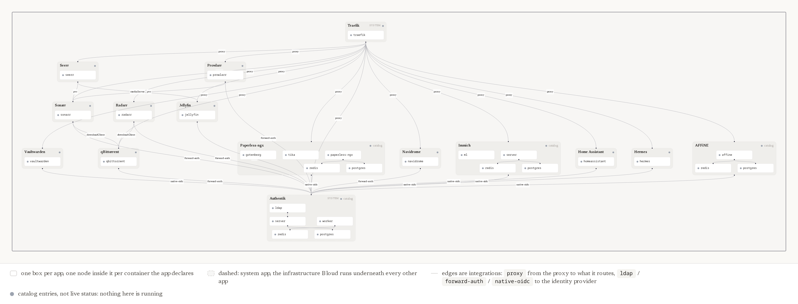

# bloud

An open-source home server. You add an app; the reverse proxy, the unified login, the database,
and the wiring between apps happen automatically.

[](LICENSE)
[]()

Self-hosting is kind of unreasonably hard. Not the installing part. The part after: the proxy
rules, the OAuth clients, the database credentials, the API keys you paste from one web UI into
another. Bloud moves that job out of your head and into the software.

## try it

Debian 13, x86_64.

```bash
curl -fsSL https://raw.githubusercontent.com/d-buckner/bloud/main/install.sh | sudo sh
```

Open the dashboard. Set your host under Settings, then Hosts. Install Jellyfin.

That is the whole setup. The installer fetches the published `.deb` and hands it to `apt`,
which pulls the real dependency set: Podman 5, `uidmap`, `dbus-user-session`, and the rest.
The `.deb` does the rest of the provisioning itself: a dedicated unprivileged `bloud` user,
its subuid ranges, linger, the sysctl that lets a rootless container bind port 80, and the
user-level host-agent service.

The script is short, and you should read it before piping it to a shell:
[install.sh](install.sh). To do it by hand instead, grab the `.deb` from
[the releases page](https://github.com/d-buckner/bloud/releases) and run
`sudo apt install ./bloud_*.deb`.

**Please don't expose bloud to the public internet**. It's currently in alpha and uses plain HTTP at the moment. There is also no robust security update mechaism for apps or the system itself at this moment.

## what just happened

When you clicked install:

1. The API pushed an intent onto a typed queue. It did not install anything itself.
2. The engine resolved the dependency graph. Jellyfin needs Authentik; Authentik needs
   PostgreSQL and Redis; everything needs Traefik.
3. Containers came up in topological order, in parallel within each level.
4. Secrets were generated. An LDAP binding was created in Authentik. Routes were written to
   Traefik.
5. Jellyfin was verified through its own API, not through our own bookkeeping.
6. The loop started again. It runs forever, every few seconds, and does nothing when nothing has
   changed.

Step 6 is the point. The same loop that installed your apps is the loop that brings them back
after a power cut. There is no recovery code, because a reboot is just a disturbance the loop
reads and responds to like any other.

## what makes this thing unlike the others?

Anyone can run `podman run` and get great self-hosted apps up and running. The differentiator is not container installation. It is the **engine**: a reconciliation control loop, built the way Kubernetes controllers are, that reads what each app declares, works out the wiring, and keeps those relationships correct forever.

Two rules make it work:

- **Single writer.** Only the orchestrator authors lifecycle state or performs side effects.
  HTTP handlers submit intents and never mutate anything.
- **Idempotent configurators.** `PreStart` and `PostStart` run on every cycle. A configurator
  that breaks when it runs twice is a bug, not a caveat.

Generating a config file once is easy. Generating a whole homelab's worth of config files and maintaining them indefinitely is not.

## the full graph

Every app, the containers each one declares, and the edges that connect them.

The picture is not drawn by a diagramming tool. CI renders it in a headless browser with the
same components that draw the developer graph inside a running Bloud, fed a snapshot of the
whole catalog that `./bloud depgraph --json` derives from every app's `metadata.yaml`. Nothing
in it is installed and nothing is running.



The text form of the same graph is in
[docs/architecture/dependency-graph.md](docs/architecture/dependency-graph.md), and that is
what `--write` refreshes and `--check` gates. The README's prose does not move with the
catalog: adding an app regenerates the picture, and a merge that touches neither the catalog
nor the renderer leaves it alone.

```bash
npm run graph:image   # rebuild the picture locally
```


## catalog

Thirteen apps, plus the two system ones Bloud needs to run itself. Each carries a verified
support contract: install, shared login, persistence, reboot, removal. Small on purpose. A
half-supported app is worse than no app in my opinion.

- AFFiNE
- Hermes
- Home Assistant
- Immich
- Jellyfin
- Navidrome
- Paperless-ngx
- Prowlarr
- qBittorrent
- Radarr
- Seerr
- Sonarr
- Vaultwarden

Plus the system apps: Authentik (identity) and Traefik (network).

The media stack is the clearest illustration of what the engine buys you. Sonarr, Radarr,
Prowlarr, qBittorrent, and Seerr are five separate projects that become useful only once they
talk to each other. Bloud wires them: each PVR gets qBittorrent as a download client with its
own category and folder, Prowlarr syncs indexers into both, Seerr becomes the request front end
and onboards itself to Jellyfin. Without the wiring you have five web UIs and no pipeline.

Bloud ships no media, no indexers, no trackers, and takes no position on what you point it at.
It is built for things you have the right to use.

## one login

| Strategy | Apps |
|---|---|
| **LDAP** | Jellyfin |
| **Forward auth** | Navidrome, Sonarr, Radarr, Prowlarr, qBittorrent |
| **Native OIDC** | Home Assistant, Immich, AFFiNE, Hermes, Paperless-ngx, Vaultwarden |

Native-protocol clients, a Subsonic player or a TV app talking to Jellyfin, keep their own
documented login path. Bloud does not break the client you already like.

## what is not done yet

Alpha, and specific.

- **No TLS.** Plain HTTP only. Let's Encrypt on Traefik, or Tailscale Serve, is the planned
  follow-up. Fine on your LAN if you accept it; not acceptable off-LAN. Biggest gap.
- **Sharing in progress.** Core sharing works. Tailnet outpost auth is still in development.
- **No `bloud init`.** First-run host config happens in the dashboard.
- **Debian 13 only.** A support contract has to be true somewhere before it spreads.
- **The loop is not yet hardened against every failure mode.** The auth bypass is remotely
  forgeable and is the current shipping blocker. Full ledger:
  [docs/operations/tech-debt.md](docs/operations/tech-debt.md).

## developing it

```bash
npm run setup            # pick backend, check prereqs, build ./bloud
./bloud dev              # build + deploy + run (Ctrl-C to stop)
./bloud install jellyfin # through the real API
./bloud validate --tier fast
```

Backends: Lima on macOS (automatic), QEMU on Linux (default), native on Linux CI
(`BLOUD_BACKEND=native`). No hot reload; re-run `./bloud dev` after any change. Apps land at
`http://<app>.localhost:8080`.

The integration tier runs the real graph path rather than a shortcut: host-agent deployed as a
systemd user service, Jellyfin installed through `POST /api/apps/jellyfin/install`, the
orchestrator converged, behavioral tests run inside the VM. Tests assert what the app's own API
reports, not what our config values happen to be.

```bash
./bloud validate --tier integration   # real install/reconcile flow
./bloud e2e lifecycle                 # install -> restart -> uninstall -> cleanup
```

## ai disclosure

While the high level technical design and architecture are done by me personally, much of the
low level implementation is done by LLM. For me, this is done with local models hosted on my
own hardware (qwen3.8-flash-next at the time of writing). If this does not align with the values you want your software to have, I
understand and this project may not be for you.

## further reading

- [docs/README.md](docs/README.md): index of all documentation
- [docs/specs/spec.md](docs/specs/spec.md): authoritative first-release plan
- [docs/specs/reconciler-spec.md](docs/specs/reconciler-spec.md): reconciler subsystem design
- [docs/architecture/overview.md](docs/architecture/overview.md): component overview
- [docs/guides/contributing-apps.md](docs/guides/contributing-apps.md): how to add an app
- [docs/features/sharing.md](docs/features/sharing.md): federated sharing design

## license

AGPL v3. See [LICENSE](LICENSE).
