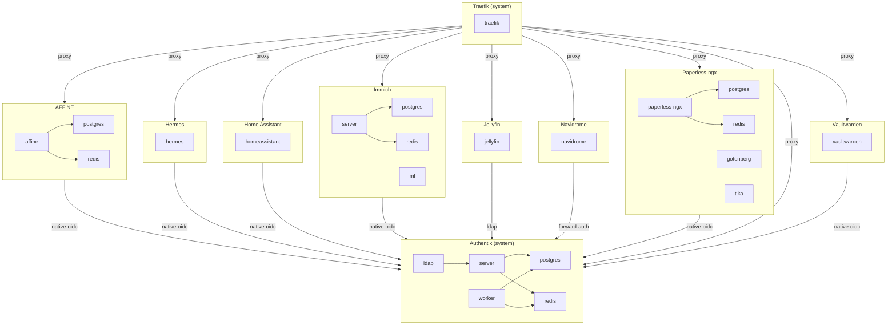

# Bloud

An open-source home server. You add an app; the reverse proxy, SSO, and app-to-app integrations happen automatically.

[](LICENSE)
[]()

---

## The problem

Self-hosting is kind of unreasonably hard. Installing one service is manageable.
Everything around it is not. Every service needs its own reverse proxy rules, SSO
wiring, configurations, and keeping it all connected and running is a pile of manual,
easy-to-forget glue.

To connect services together, you typically have to:

- Generate an API key in one service and paste it into the other
- Create an OAuth client in your identity provider (client ID, secret, callback URL)
  and paste those back into the first service
- Register each service with the reverse proxy separately
- Provision and wire up a database for each
- Remember all of it when you reinstall or migrate

On every other platform, you are the integration layer. Bloud flips this. Apps declare
what they provide and what they consume. Bloud holds that integration knowledge and does
the wiring itself, on install and on every restart.

The broader goal is that digital ownership and control shouldn't be reserved for people
who enjoy being their own sysadmin. Owning your photos, music, and data should be
accessible to more than the self-hosting crowd. Sharing them should be too.

## What you get

Install Bloud on a Debian box and get:

- One dashboard for all your services
- One account and a shared login across every app
- One-click app installation, dependencies included
- Automatic inter-app configuration: API keys, OIDC clients, LDAP setup
- Automatic routing through Traefik over HTTP (TLS is a planned follow-up)
- Reliable reconciliation after failures and reboot
- Per-app databases, isolated from each other
- Your server reachable on `localhost` or your own domain (reach-by-name via real DNS or Tailscale is a planned follow-up)
- Sharing with people who don't need to manage anything

Bloud's differentiator isn't container installation; anyone can run `podman run`.
It's the **engine**: the reconciliation layer that reads what each app declares,
works out the wiring (API keys, OIDC clients, LDAP, databases, routes), and keeps
those relationships correct forever: on install, after a crash, and on every reboot.

## How it works

Each app ships a declarative manifest declaring its integrations. When you install an app, Bloud resolves its dependency graph and starts everything in
order. Apps that need storage (like Immich) declare their own PostgreSQL and Redis
containers, each with its own isolated database. Apps that don't (like Jellyfin) just
declare the integrations they use.

```
Level 0: traefik          ← System infra, starts first
Level 1: jellyfin          ← Proxy + SSO; no database of its own
Level 1: immich             ← Self-contained: postgres + redis + server + ML
```

### The engine

The heart of Bloud is the **engine**: a reconciliation control loop, directly
inspired by how Kubernetes controllers work. You declare intent (the apps you
want, plus what each app *provides* and *consumes*); the engine continuously
drives reality to match, converging the dependency graph level by level and
re-converging on every crash or reboot.

Concretely: every change is pushed onto a typed **intent queue**. The engine drains
it, resolves the dependency graph, and runs each node through its lifecycle
(`INITIALIZING → PRESTART → STARTING → POSTSTART → RUNNING`), creating containers,
generating Traefik routes, and provisioning SSO clients and secrets, until the
observed state matches the declared state. Like a k8s controller, it's idempotent:
when reality already matches intent, it does nothing. And the engine is the *single
writer*: the HTTP API only submits intents; it never mutates state directly.

This is what makes Bloud self-healing rather than a one-shot installer: the same loop
that installed your apps is the loop that brings them back after a power cut.

## App catalog

The catalog is deliberately small. Each app ships a verified support contract covering
install, shared login, persistence, reboot, and removal. We'd rather support fewer apps
well.

| App | Category | What it gives you |
|---|---|---|
| Traefik | Infrastructure | Reverse proxy and routing (system) |
| Authentik | Infrastructure | Identity provider (one login everywhere) |
| Jellyfin | Media | Movies, TV, and music streaming |
| Navidrome | Media | Your music library with Subsonic-compatible clients |
| Immich | Photos | Private photo and video management |
| Home Assistant | Productivity | Open-source home automation platform |
| AFFiNE | Productivity | AI-native knowledge base: docs, databases, whiteboards |
| Hermes | Productivity | Self-improving AI agent with persistent memory and scheduled automations |
| Paperless-ngx | Productivity | Document management: scans and PDFs become a searchable archive |

## The full graph

Every app in the catalog, the containers each one declares, and the edges that
connect them. The diagram below is generated from the `metadata.yaml` files
on every merge to `main`, so it is a view of the catalog rather than a
picture someone has to remember to update. `./bloud depgraph` prints it, and
`./bloud depgraph --write` refreshes this section; the same structure drives
the developer graph in the dashboard.

<!-- BEGIN GENERATED DEPENDENCY GRAPH -->
<!-- Generated by `./bloud depgraph --write` from `apps/*/metadata.yaml`. Do not edit by hand. -->



_Each box is one app; the nodes inside it are that app's containers, with an arrow from a container to every container it depends on. Arrows between boxes are integrations: a `proxy` arrow is drawn from the proxy to the apps it routes, and an SSO arrow is labeled with the app's strategy (`ldap`, `forward-auth`, `native-oidc`)._
<!-- END GENERATED DEPENDENCY GRAPH -->


## One login everywhere

Apps get SSO automatically, using whatever strategy fits them:

| Strategy | How it works | Apps |
|---|---|---|
| **LDAP** | Authentik supplies credentials for apps that don't speak OAuth2 | Jellyfin |
| **Forward Auth** | Traefik asks Authentik before reaching the app | Navidrome |
| **Native OIDC** | The app speaks OpenID Connect directly to Authentik | Home Assistant, Immich, AFFiNE, Hermes, Paperless-ngx |

Native-protocol clients (a Subsonic music player, a TV app talking to Jellyfin) have
their own documented login path.

## Sharing

Self-hosting's other barrier: even if you can run software, your friends and family
usually can't. Bloud's sharing is built on Tailscale or a self-hosted Headscale so the
other person stays a guest, not a sysadmin.

- **Per-app sharing.** Share Jellyfin with your parents without sharing the rest of
  your server.
- **Direct, revocable invites.** A single-use token for a specific person, revocable at
  any time.
- **Nothing to install on their side.** A friend's Bloud instance proxies your shared
  app locally, so even a TV or game console can use it. Smart clients can connect
  directly for lower latency.

Sharing work is in progress (Phase 6 of the [release plan](docs/specs/spec.md)).

## Status

Alpha. We're working on the sharing and federation layer, then packaging for a
one-command install on Debian 13.

## AI Disclosure
While the high level technical design and architecture are done by me personally, much of the low level implementation is done by LLM. For me, this is done with local models hosted on my own infrastructure. If this does not align with the values you want your software to have, I understand, this project may not be for you.

## Local development

Everything goes through the `./bloud` CLI. `npm run setup` picks your runtime
backend, checks prerequisites, and builds the CLI; `./bloud dev` is the whole loop: it builds host-agent and the
frontend, deploys them to the runtime, and runs the agent (Ctrl-C to stop).
There is no hot reload: re-run `./bloud dev` after any code change.

### Backends

The runtime is a Debian 13 environment with rootless Podman. Where it runs is
a per-checkout preference: `./bloud setup` chooses it (or the first runtime
command prompts and saves the answer) into gitignored
`.bloud/preferences.yaml`, and `BLOUD_BACKEND` overrides it:

| Backend | Platform | Chosen as | Prerequisites |
|---|---|---|---|
| **Lima** | macOS | automatic: the only applicable backend | `brew install lima` |
| **QEMU** | Linux | the default choice | `qemu-system-x86_64` |
| **Native** | Linux (CI) | a prompt choice, or `BLOUD_BACKEND=native` | podman + user-level systemd |

```bash
npm run setup            # Choose backend, check prereqs, build ./bloud
```

Every backend provisions itself on first run: `./bloud dev` creates the Lima
VM from `dev/lima.yaml`, provisions the QEMU VM under `.bloud/qemu/`, or sets
up the native runtime in `/var/tmp/bloud-native-runtime`, then builds,
deploys, and starts the agent. No separate create/start step.

### Daily development

```bash
./bloud dev              # Build + deploy + run host-agent (Ctrl-C to stop)
./bloud stop             # Stop host-agent
./bloud status           # Runtime + host-agent status
./bloud services         # App container status
./bloud logs             # Stream host-agent logs
./bloud install <app>    # Install an app via API
./bloud uninstall <app>  # Uninstall an app via API
./bloud attach           # Shell on the runtime (VM backends)
./bloud reset            # Wipe runtime data (keeps the VM)
./bloud destroy          # Delete the VM
```

Apps are then served through Traefik at `http://<app>.localhost:8080`.

### Apps that need a dev switch

Bloud serves apps over plain HTTP until it has a TLS layer. One app cannot work
that way on its own: **Vaultwarden's web vault refuses any server whose URL is not
`https://`**, so past its sign-in page nothing works (SSO, creating an account,
opening the vault). To develop or test it, opt in when you start the runtime:

```bash
BLOUD_DEV_VAULTWARDEN_ALLOW_HTTP=1 ./bloud dev     # or `1` in your shell before ./bloud e2e
```

The variable is forwarded to the host-agent on every backend. It is off by default,
only honored for `localhost` names, and it weakens a security check in that one
app's web client, so it is for development and browser tests only (CI sets it for
the `vaultwarden` job). Without it Vaultwarden still installs and its server side
works; only the browser flows past the sign-in page fail, and the Playwright spec
skips its sign-in rung. See
[`apps/vaultwarden/INTEGRATION.md`](apps/vaultwarden/INTEGRATION.md#plain-http)
for what it does and why.

### Validation

```bash
./bloud validate                     # Changed-file-based (default)
./bloud validate --tier fast         # Unit tests only (~30s)
./bloud validate --tier integration # Real install/reconcile flow on the runtime
./bloud e2e                         # Playwright against a running ./bloud dev
./bloud e2e lifecycle               # Full build → deploy → install → verify → uninstall
./bloud e2e app                     # Single app's spec on its own runtime (CI)
```

## Project structure

```
bloud/
├── apps/                          # App catalog (one dir per app)
│   ├── jellyfin/
│   │   ├── metadata.yaml          # Integrations, SSO, port, container spec
│   │   ├── configurator.go        # PreStart/PostStart runtime hooks
│   │   └── icon.png
│   ├── affine/                    # + authentik/, immich/,
│   └── traefik/                   #   hermes/, navidrome/, paperless-ngx/, vaultwarden/
│
├── services/host-agent/           # Go backend + Svelte frontend
│   ├── cmd/host-agent/            # Entry point, bootstrap
│   ├── internal/
│   │   ├── engine/                # ★ The differentiator: the reconcile engine
│   │   │   ├── orchestrator/      #   Typed intent queue + lifecycle reconciler
│   │   │   └── graph/             #   The dependency graph the engine converges
│   │   ├── catalog/               # App discovery from metadata.yaml
│   │   ├── sso/                   # OIDC / LDAP / forward-auth wiring
│   │   ├── secrets/               # Per-instance generated keys
│   │   ├── traefikgen/            # Route generation from the graph
│   │   ├── store/                 # SQLite persistence
│   │   └── api/                   # HTTP API: submits intents, never writes state
│   ├── pkg/
│   │   ├── authentik/             # Authentik REST API client
│   │   └── configurator/          # Configurator interface + helpers
│   └── web/                       # Svelte frontend
│
├── cli/                           # ./bloud CLI (lima / qemu / native backends)
├── e2e/                           # Playwright browser tests
├── dev/                           # VM configs (lima.yaml, qemu.yaml)
├── specs/                         # Release + subsystem specs
├── validation.yaml                # ./bloud validate manifest
└── docs/                          # Architecture and contribution guides
```

## Further reading

- [docs/specs/spec.md](docs/specs/spec.md): Authoritative first-release plan
- [docs/specs/reconciler-spec.md](docs/specs/reconciler-spec.md): Reconciler subsystem design
- [docs/architecture/overview.md](docs/architecture/overview.md): Component overview
- [docs/guides/contributing-apps.md](docs/guides/contributing-apps.md): How to add a new app
- [docs/features/sharing.md](docs/features/sharing.md): Federated sharing design and implementation plan

## Contributing

Contributions welcome, especially new apps with verified support contracts. Open an
issue with a clear description before starting significant work.

## License

AGPL v3. See [LICENSE](LICENSE) for details.
