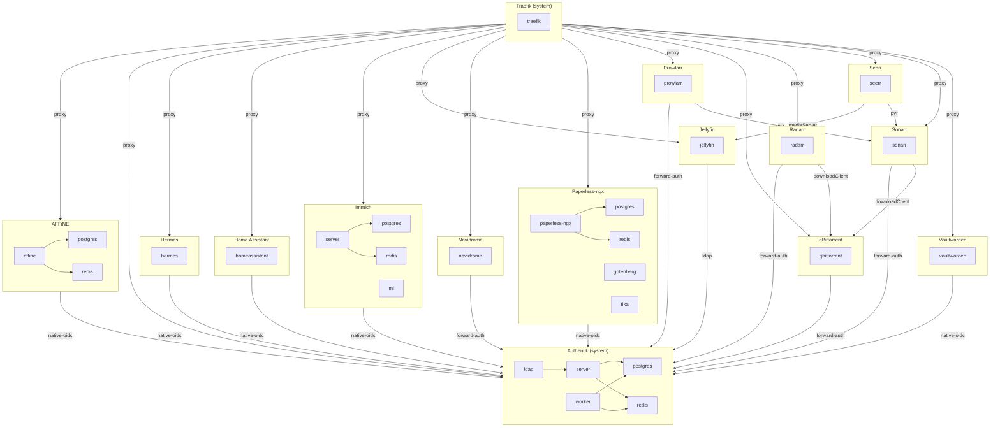

# The dependency graph

The whole catalog as one graph: every app, every container each app declares,
and the integration edges between them. This is the text form of the picture
in [the README](../../README.md#the-full-graph), which is rendered from the
same snapshot in a browser.

`./bloud depgraph` prints the diagram, `--write` refreshes the block below,
and `--check` is the PR-time gate that fails when the committed block no
longer matches the catalog. The merge-to-main job regenerates both this file
and the README image whenever the catalog they depict changes, or the code
that draws them changes, so neither is something a contributor has to
remember, and a merge that touches neither leaves both exactly as they were.

The JSON the image is rendered from is the same topology: `./bloud depgraph
--json` emits it in the shape `/api/system/developer` returns, which is what
lets the dashboard's own components draw a catalog nothing has installed.

<!-- BEGIN GENERATED DEPENDENCY GRAPH -->
<!-- Generated by `./bloud depgraph --write` from `apps/*/metadata.yaml`. Do not edit by hand. -->

_Each box is one app; the nodes inside it are that app's containers, with an arrow from a container to every container it depends on. Arrows between boxes are integrations: a `proxy` arrow is drawn from the proxy to the apps it routes, and an SSO arrow is labeled with the app's strategy (`ldap`, `forward-auth`, `native-oidc`)._
<!-- END GENERATED DEPENDENCY GRAPH -->

