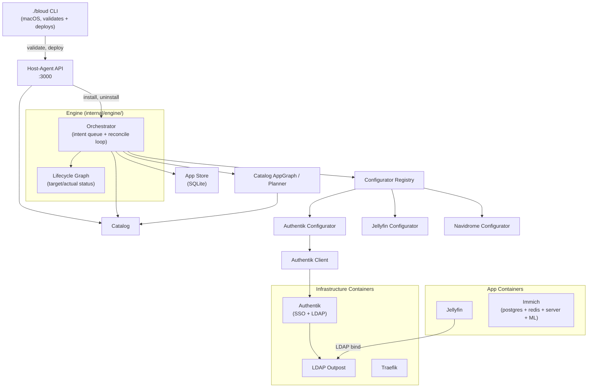

# Architecture

Bloud manages apps (Jellyfin, Immich, etc.) on a single Linux host. The heart of it is
the **engine**: a reconciliation control loop, directly inspired by how Kubernetes
controllers work. You declare intent (the apps you want, plus what each app *provides*
and *consumes*); the engine continuously drives reality to match, converging the
dependency graph level by level and re-converging after every crash or reboot.

The engine ships inside a single Go binary, the `host-agent`, alongside a small HTTP API
that only submits intents. Everything the engine reconciles (containers, routes, SSO
clients, secrets) it reaches through the Podman API and the per-app configurators
described below.

> **Naming note:** earlier docs called this component the *reconciler*. It was refactored
> into the **orchestrator**, and the orchestrator together with its dependency-graph
> package is now grouped under `internal/engine/`: the name for the whole reconciliation
> loop. `docs/specs/reconciler-spec.md` describes that architecture as implemented.

## Component Diagram

This is the hand-written component map. For the catalog-derived view of every
app, the containers it declares, and the integration edges between them, see
the generated [dependency graph in the README](../../README.md#the-full-graph):
`./bloud depgraph` prints it, `--write` refreshes the README section, and the
merge-to-main job commits the refresh, so that view cannot drift from
`apps/*/metadata.yaml`.



## Components

### Host-Agent CLI (`services/host-agent/cmd/host-agent/`)

Entry point. Runs as a systemd user service (API mode) or executes one-shot commands.

| Subcommand | Purpose |
|---|---|
| *(none)* | Start the REST API server on `:3000` |
| `configure` | One-shot configure commands (prestart/poststart/etc.) |
| `init-secrets` | Generate and persist initial secrets |

### Catalog (`internal/catalog/`)

Discovers apps by reading `apps/*/metadata.yaml`. Each app declares its name, port,
SSO strategy, integration requirements, and container spec. The catalog is held in an
in-memory `MemoryCache` and refreshed from disk on demand. The `catalog.AppGraph` (a.k.a.
the planner) resolves dependency plans via `PlanInstall`/`PlanRemove`.

### Dependency Resolution (planner)

Apps declare integrations in `metadata.yaml`:

```yaml
integrations:
  database:
    required: true
    compatible: [{ app: postgres, default: true }]
  sso:
    required: false
    compatible: [{ app: authentik }]
```

Resolution happens through `catalog.AppGraph.PlanInstall` during the install intent:
- Exactly one installed compatible provider → auto-config binding.
- Multiple / none for a required integration → produces an integration *choice*.
- Optional integrations with no compatible provider → no binding.
> Note: an earlier standalone integration resolver (`internal/integration/`) was
> removed; dependency resolution is owned by the planner + orchestrator. Apps that
> need databases (Immich, Authentik) declare their own postgres and redis containers
> in `containers:`; each app gets its own isolated database.

### The Engine (`internal/engine/`)

The engine is Bloud's differentiator: a reconciliation control loop directly inspired by
Kubernetes controllers. It lives in two packages: `orchestrator/` (the typed intent queue
and the loop that drains it) and `graph/` (the lifecycle DAG whose `targetStatus` vs
`actualStatus` the loop converges). You declare the desired state; the engine observes the
actual state and runs the actions needed to close the gap, then keeps running them, so a
crash or reboot simply triggers another convergence pass.

All mutations flow through a typed intent queue with debounce. The orchestrator is the
single writer to all stores and the single executor of all side effects. It is also the
owner of the lifecycle graph (`graph.Graph`) that tracks desired (`targetStatus`) vs
observed (`actualStatus`) per node.

Intent types (`intent.go`):
- **InstallAppIntent**: install an app by name
- **UninstallAppIntent**: remove an app (with optional `clearData`)
- **RenameAppIntent**: change an app's display name
- **SetTailnetIntent / DeleteTailnetIntent**: tailnet configuration changes
- **AddRemoteAppIntent / DeleteRemoteAppIntent**: remote app management
- **ClearAppDataIntent**: wipe app data
- *(Share/guest records are not intents by design: pure store writes with no
  lifecycle side effects, and invite creation returns its token synchronously.
  The sharing API writes them directly; see docs/specs/review.md §C3)*

The orchestrator drains the intent queue, applies intents to stores (desired state), then
converges actual state toward desired: sync container state, handle uninstalls, populate
the graph, converge tailnet, run a topological reconcile pass (per-level concurrent,
phases `INITIALIZING→PRESTART→STARTING→POSTSTART→RUNNING`), and finally regenerate
Traefik routes before promoting nodes to RUNNING.

```go
type Intent interface {
    intentMarker()  // sealed interface
    IntentID() string
}
```

### Configurator Framework (`pkg/configurator/`)

Generic interface for app-specific runtime configuration that can't be expressed in
static container definitions (API calls, credential rotation, plugin setup).

```go
type NodeLifecycle interface {
    Name() string
    PreStart(ctx context.Context, state *AppState) (changed bool, err error)
    PostStart(ctx context.Context, state *AppState) error
}
```

Teardown is optional and separate: a configurator that owns removal implements
`Remover` (`Remove(ctx context.Context, state *AppState, clearData bool) error`),
which the orchestrator calls only when present. The orchestrator removes
containers and app data itself, so most configurators do not.

**`AppState`** carries typed integration outputs into each configurator:

```go
type AppState struct {
    DataPath      string
    BloudDataPath string
    SSOEnabled    bool
    LDAP          *LDAPOutput  // host, port, baseDN, bindUser, bindPassword
}
```

**Implementations:**
- **Authentik**: sets admin password, ensures API token, creates LDAP infrastructure
- **Jellyfin**: completes setup wizard, creates libraries, configures LDAP plugin
- **Navidrome**: SSO/config wiring
- **AFFiNE**: writes the OIDC config file (public URL + provider), bootstraps the
  first-run owner account, verifies the OIDC preflight round-trip


### App Client & Assets (`pkg/appclient/`, `pkg/appasset/`)

The framework layer every configurator runs its integration through, so app
code never touches raw `net/http` or hand-rolls downloads, waits, or retries:

- **`pkg/appclient`**: a typed HTTP surface. A `Client` (built from `deps.HTTP`,
  a shared-transport factory) issues `Call`s with a verb and exactly one
  terminal: `Do` (raw body), `DoInto` (JSON decode), `Ensure` (idempotent
  create-or-verify), or `Wait` (poll a readiness predicate until ready/deadline).
  Retries with backoff, per-request timeouts, declarative outcome contracts
  (`OK`/`AlreadyDone`), auth (`TokenSpec` with 401 refresh covering every header
  dialect), and "still booting / already done" handling live here rather than in
  each app. A PostStart finalization is bounded by the orchestrator's
  `PostStartBudget` (default 150s); configurators use the passed ctx directly
  and never detach with `context.Background()`/`WithoutCancel`.
- **`pkg/appasset`**: static-file install. `deps.Assets.Install(ctx, Asset{…})`
  sources bytes remotely, from `go:embed`, or locally into a content-addressed
  cache under `BLOUD_DATA_DIR`; a required `SHA256` guards the payload (a
  mismatch deletes the poisoned cache entry and fails rather than installing a
  retagged file), Zip unpack is zip-slip-safe, and a sentinel/`SkipIf` keeps
  installs idempotent. Every pinned remote asset records its provenance in the
  app's `INTEGRATION.md` under **Verified constants**.

A `forbidigo` rule in `.golangci.yml` (run by `npm run lint:go`, so it gates the
`fast` tier and CI) keeps `apps/**/*.go` free of raw `net/http`
(`http.NewRequest`, `http.DefaultClient`, `http.Client`/`http.Client.Do`): the
sanctioned terminal is appclient's `.Do(ctx)`. The same rule forbids direct file
writes (`os.WriteFile` and friends, in favour of `pkg/managedfile.Write`) and
`os/exec` (in favour of `Deps.Exec`/`Deps.RestartContainer`) in app
configurators.

### Authentik Client (`pkg/authentik/`)

Manages the Authentik identity provider via its REST API. Key operations:
`EnsureLDAPInfrastructure`, `EnsureBloudOAuthApp` (idempotent OIDC bootstrap), SSO
provisioning, and forward-auth provider creation for tailnet access.

### App Store (`internal/store/`)

SQLite-backed persistence for installed apps, their status, and resolved integration
bindings. The orchestrator reads desired state from here and (as single writer) is the
only author of lifecycle status. Schema lives in `internal/db/schema.sql`. The lifecycle
orchestrator currently uses an in-memory repository (see docs/specs/review.md §C2).

### Container Runtime (`internal/container/`, `internal/engine/orchestrator/`)

Apps run as Podman containers created and managed directly by the orchestrator through
the Podman API (`internal/podman/`). The orchestrator builds a container spec from
`metadata.yaml`, creates/starts containers, and removes them on uninstall.

Container specs are defined in `metadata.yaml` under the `containers:` key (one def per
container, multi-container apps expand to one graph node each) and rendered with template
variables (data paths, passwords, etc.) at install time.

## Data Flow: Installing an App

```
User clicks "Install Jellyfin"
  → API submits InstallAppIntent to the intent queue (202 accepted)
  → Orchestrator drains intent → applyInstallIntent
      → catalogGraph.PlanInstall(app) resolves dependencies
      → records dependency providers + target app in the store
  → Convergence pass:
      1. SyncContainerState (align DB with reality)
      2. populateGraphNodes: build DAG from installed store records
      3. Reconcile each container node in topological order:
         a. PreStart (configurator, if registered)
         b. Ensure container (create/start, idempotent)
         c. Health check (from container metadata)
         d. PostStart (configurator, if registered)
      4. RegenerateRoutes (Traefik dynamic config); then promote nodes to RUNNING
  → All apps healthy, SSO/LDAP/login works
```

For apps with databases (e.g. Immich), the dependency graph includes their per-app
postgres and redis containers declared in `containers:` metadata.

## Validation Tiers

| Tier | Scope | Command |
|---|---|---|
| `fast` | Unit tests, type checks | `./bloud validate --tier fast` |
| `integration` | Backend against real services on the runtime | `./bloud validate --tier integration` |

## Dev Environment

Three interchangeable runtimes, selected per checkout via
`.bloud/preferences.yaml` (chosen by `./bloud setup`, or prompted on first
use; `BLOUD_BACKEND` overrides): `lima` is automatic on macOS, Linux picks
`qemu` (VM) or `native` (no VM):

Lima VM (Debian, Apple Virtualization), macOS:

```
macOS host
  └── Lima VM "bloud-dev"
        ├── Podman (rootless)
        │   ├── Authentik + LDAP Outpost
        │   ├── Traefik  :80 (canonical) + :8080 (compat)
        │   └── App containers (Jellyfin, Immich w/ its own postgres+redis, etc.)
        └── host-agent binary (:3000, systemd user service)
```

QEMU VM (Debian, KVM), Linux (default backend after `./bloud setup`):

```
Linux host
  └── QEMU VM "bloud-qemu" (qemu-system-x86_64, KVM, hostfwd SSH :2222)
        ├── Podman (rootless, provisioned via cloud-init NoCloud seed)
        │   └── same service stack as Lima
        └── host-agent binary (:3000)
```

Traefik's canonical `:80` and each app's direct port are forwarded to the host
localhost by `./bloud dev` (Traefik lands on host `:8080`, so browser and e2e
URLs stay on `http://localhost:8080`). The native backend needs no forwarding;
everything already runs on the host.
