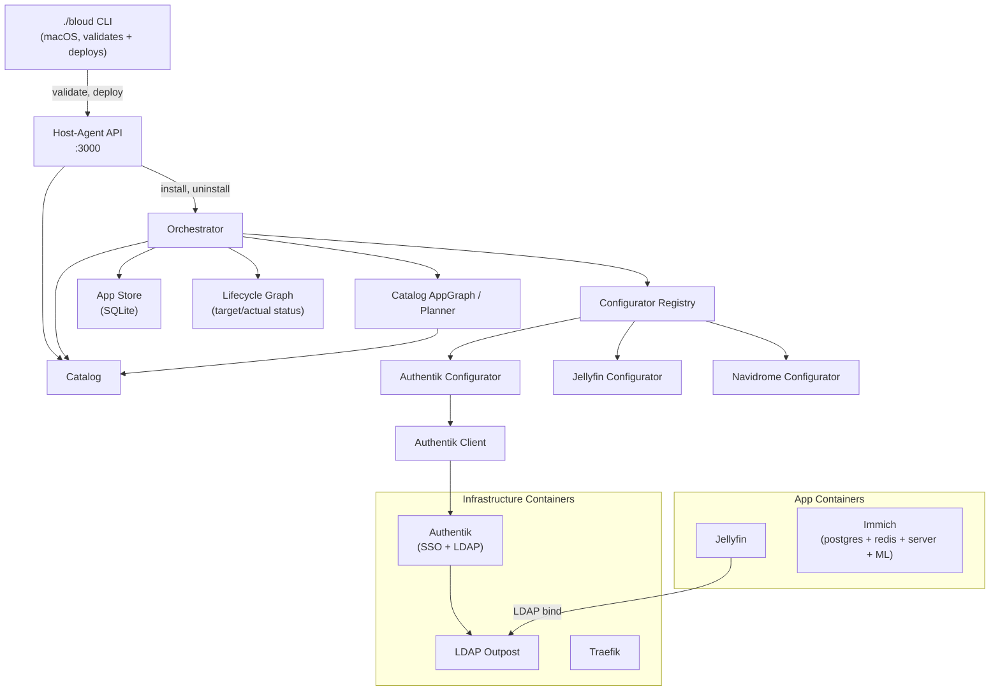

# Portable Runtime Architecture

Bloud manages apps (Jellyfin, Immich, etc.) on a single Linux host. The **portable
runtime** is the Go binary (`host-agent`) that orchestrates app lifecycle, configuration,
and integration via the Podman API.

> **Naming note:** earlier docs called this component the *reconciler*. It was refactored
> into the **orchestrator** (`internal/orchestrator/`), which owns both intent draining
> `specs/reconciler-spec.md` describes that target architecture as
> implemented.

## Component Diagram



## Components

### Host-Agent CLI (`services/host-agent/cmd/host-agent/`)

Entry point. Runs as a systemd user service (API mode) or executes one-shot commands.

| Subcommand | Purpose |
|---|---|
| *(none)* | Start the REST API server on `:3000` |
| `configure` | One-shot configure commands (prestart/poststart/etc.) |
| `init-secrets` | Generate and persist initial secrets |
| `front-proxy` | Root-level port-80 reverse proxy → Traefik `:8080`; serves a "starting up" page until the stack is healthy (runs as `bloud-front.service`) |

### Catalog (`internal/catalog/`)

Discovers apps by reading `apps/*/metadata.yaml`. Each app declares its name, port,
SSO strategy, integration requirements, and container spec. The catalog is held in an
in-memory `MemoryCache` and refreshed from disk on demand. The `catalog.AppGraph` (a.k.a.
the planner) resolves dependency plans via `PlanInstall`/`PlanRemove`.

### Dependency Resolution (planner)

Apps declare integrations in `metadata.yaml`:

```yaml
integrations:
  database:
    required: true
    compatible: [{ app: postgres, default: true }]
  sso:
    required: false
    compatible: [{ app: authentik }]
```

Resolution happens through `catalog.AppGraph.PlanInstall` during the install intent:
- Exactly one installed compatible provider → auto-config binding.
- Multiple / none for a required integration → produces an integration *choice*.
- Optional integrations with no compatible provider → no binding.
> Note: an earlier standalone integration resolver (`internal/integration/`) was
> removed — dependency resolution is owned by the planner + orchestrator. Apps that
> need databases (Immich, Authentik) declare their own postgres and redis containers
> in `containers:`; each app gets its own isolated database.

### Orchestrator (`internal/orchestrator/`)

All mutations flow through a typed intent queue with debounce. The orchestrator is the
single writer to all stores and the single executor of all side effects. It is also the
owner of the lifecycle graph (`graph.Graph`) that tracks desired (`targetStatus`) vs
observed (`actualStatus`) per node.

Intent types (`intent.go`):
- **InstallAppIntent** — install an app by name
- **UninstallAppIntent** — remove an app (with optional `clearData`)
- **RenameAppIntent** — change an app's display name
- **SetTailnetIntent / DeleteTailnetIntent** — tailnet configuration changes
- **AddRemoteAppIntent / DeleteRemoteAppIntent** — remote app management
- **ClearAppDataIntent** — wipe app data
- *(CreateShareIntent / RevokeShareIntent are defined but shares are currently written
  directly by the sharing API module)*

The orchestrator drains the intent queue, applies intents to stores (desired state), then
converges actual state toward desired: sync container state, handle uninstalls, populate
the graph, converge tailnet, run a topological reconcile pass (per-level concurrent,
phases `INITIALIZING→PRESTART→STARTING→POSTSTART→RUNNING`), and finally regenerate
Traefik routes before promoting nodes to RUNNING.

```go
type Intent interface {
    intentMarker()  // sealed interface
    IntentID() string
}
```

### Configurator Framework (`pkg/configurator/`)

Generic interface for app-specific runtime configuration that can't be expressed in
static container definitions (API calls, credential rotation, plugin setup).

```go
type NodeLifecycle interface {
    Name() string
    PreStart(ctx context.Context, state *AppState) (changed bool, err error)
    PostStart(ctx context.Context, state *AppState) error
    Remove(ctx context.Context, state *AppState, clearData bool) error
}
```

**`AppState`** carries typed integration outputs into each configurator:

```go
type AppState struct {
    DataPath      string
    BloudDataPath string
    SSOEnabled    bool
    LDAP          *LDAPOutput  // host, port, baseDN, bindUser, bindPassword
}
```

**Implementations:**
- **Authentik** — sets admin password, ensures API token, creates LDAP infrastructure
- **Jellyfin** — completes setup wizard, creates libraries, configures LDAP plugin
- **Navidrome** — SSO/config wiring
- **AFFiNE** — writes the OIDC config file (public URL + provider), bootstraps the
  first-run owner account, verifies the OIDC preflight round-trip

### Authentik Client (`pkg/authentik/`)

Manages the Authentik identity provider via its REST API. Key operations:
`EnsureLDAPInfrastructure`, `EnsureBloudOAuthApp` (idempotent OIDC bootstrap), SSO
provisioning, and forward-auth provider creation for tailnet access.

### App Store (`internal/store/`)

SQLite-backed persistence for installed apps, their status, and resolved integration
bindings. The orchestrator reads desired state from here and (as single writer) is the
only author of lifecycle status. Schema lives in `internal/db/schema.sql`. The lifecycle
orchestrator currently uses an in-memory repository (see specs/review.md §C2).

### Container Runtime (`internal/container/`, `internal/orchestrator/`)

Apps run as Podman containers created and managed directly by the orchestrator through
the Podman API (`internal/podman/`). The orchestrator builds a container spec from
`metadata.yaml`, creates/starts containers, and removes them on uninstall.

Container specs are defined in `metadata.yaml` under the `containers:` key (one def per
container, multi-container apps expand to one graph node each) and rendered with template
variables (data paths, passwords, etc.) at install time.

### mDNS Publisher (`internal/mdns/`)

Advertises the instance's `.local` hostnames over Multicast DNS (RFC 6762) so
LAN devices can reach the dashboard and apps as `http://bloud.local` and
`http://<app>.bloud.local` without DNS configuration. The publisher owns one
UDP socket on port 5353 on the interface carrying the host's primary IPv4: it
answers A queries for the advertised names and re-announces records at least
every TTL (120s) so resolver caches stay fresh. The record set is recomputed
from live state — the host set plus one `<app>.<host>` subdomain per routable
installed app (mirroring the domain-agnostic Traefik routes) — on startup, on
a 30s tick, and on app-change events from the event bus. Removed names and
shutdown send TTL-0 "goodbye" records. Only `.local` hosts are advertised;
custom domains are resolved by real DNS.

On a real host the announcer binds 5353 on the LAN interface directly. In the
dev VM, multicast never crosses the VM boundary, so the QEMU launch args
include a unicast `hostfwd=udp::<host>-:5353` (skipped, with a note, when the
host's own responder — usually avahi-daemon — owns 5353; the host port can be
remapped via `BLOUD_QEMU_FWD_5353` for verification): the host can then query
the announcer, and unicast queries get unicast replies (RFC 6762 §6.7).
LAN-wide multicast discovery from the dev VM is not possible by design of
slirp; Lima gets the same forward via `guestPort: 5353` (its default GRPC
forwarder carries UDP).

On a slirp network (`netutil.OnSlirp`, detected via the fixed 10.0.2.2
gateway) the announcer also skips its multicast announcements, re-announcements,
and TTL-0 goodbyes: they could never reach the LAN, and slirp's hostfwd
socket captures the guest's own port-5353 multicast traffic, which corrupts
the forward's state and breaks the unicast reply path. The dev-VM announcer
is therefore a unicast-only responder.

## Data Flow: Installing an App

```
User clicks "Install Jellyfin"
  → API submits InstallAppIntent to the intent queue (202 accepted)
  → Orchestrator drains intent → applyInstallIntent
      → catalogGraph.PlanInstall(app) resolves dependencies
      → records dependency providers + target app in the store
  → Convergence pass:
      1. SyncContainerState (align DB with reality)
      2. populateGraphNodes — build DAG from installed store records
      3. Reconcile — for each container node (topological order):
         a. PreStart (configurator, if registered)
         b. Ensure container (create/start, idempotent)
         c. Health check (from container metadata)
         d. PostStart (configurator, if registered)
      4. RegenerateRoutes (Traefik dynamic config) — then promote nodes to RUNNING
  → All apps healthy, SSO/LDAP/login works
```

For apps with databases (e.g. Immich), the dependency graph includes their per-app
postgres and redis containers declared in `containers:` metadata.

> ⚠️ **Known wiring gap:** the production router currently constructs the orchestrator
> app — installs no-op until this is wired. See specs/review.md §C1.

## Validation Tiers

| Tier | Scope | Command |
|---|---|---|
| `fast` | Unit tests, type checks | `./bloud validate --tier fast` |
| `integration` | Backend against real services on the runtime | `./bloud validate --tier integration` |

## Dev Environment

Three interchangeable runtimes, selected per checkout via
`.bloud/preferences.yaml` (chosen by `./bloud setup`, or prompted on first
use; `BLOUD_BACKEND` overrides): `lima` is automatic on macOS, Linux picks
`qemu` (VM) or `native` (no VM):

Lima VM (Debian, Apple Virtualization) — macOS:

```
macOS host
  └── Lima VM "bloud-dev"
        ├── bloud-front.service (root, :80 → :8080, "starting up" page)
        ├── Podman (rootless)
        │   ├── Authentik + LDAP Outpost
        │   ├── Traefik  :8080
        │   └── App containers (Jellyfin, Immich w/ its own postgres+redis, etc.)
        └── host-agent binary (:3000, systemd user service)
```

QEMU VM (Debian, KVM) — Linux (default backend after `./bloud setup`):

```
Linux host
  └── QEMU VM "bloud-qemu" (qemu-system-x86_64, KVM, hostfwd SSH :2222)
        ├── Podman (rootless, provisioned via cloud-init NoCloud seed)
        │   └── same service stack as Lima
        └── host-agent binary (:3000)
```

Ports 80, 3000, 8080, 8443, and each app's direct port are forwarded to the host
localhost by `./bloud dev` (port 80 is the front proxy: `host-agent front-proxy`
under the root `bloud-front.service`, forwarding to rootless Traefik on 8080).
The native backend needs no forwarding — everything already runs on the host.
