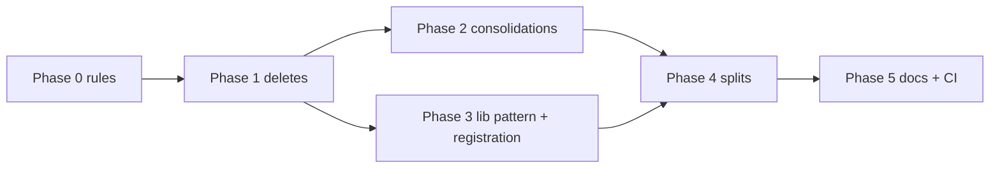

> Status: landed

# Layout Cleanup Plan

Consolidated result of the 2026-09-15 directory-structure review.
Guiding rule, codified as a new architecture invariant (Phase 0):

**A new `services/<name>` requires shipping to a machine where host-agent does
not run. Everything else decomposes as a package under `internal/` or a
subcommand of the host-agent binary.**

Deploy location, not code concern, is what earns a directory under `services/`.
SSO, orchestrator, API, store: same box as host-agent → stay packages/subcommands.
A remote tailnet outpost or control plane: different machine → its own service
when it gets built.

## Phase 0: Codify the rules (docs only)

1. **New invariant #13 in `AGENTS.md`** (deploy-location rule above).
2. **New invariant #14: wire contracts stay stdlib-only.** Token formats,
   gateway protocol constants, share-envelope types must not import
   `store`/`config`/host-agent-internal machinery, so a future extraction to a
   shared `pkg/` or module is a move, not a surgery.
   `internal/sharing/token.go` (pure stdlib, verified) is the exemplar.
3. **App helper pattern: `apps/<name>/lib/`** (see § App lib pattern below).
4. **Plan lifecycle convention:** every `plans/*.md` starts with
   `> Status: draft | accepted | landed | dropped`. Landed plans move to
   `plans/archive/`. Apply retroactively in this phase (qemu-backend,
   local-backend → landed).

## Phase 1: Deletions (zero-risk, do first)

|Action|Evidence|
|---|---|
|Delete `services/host-agent/.air.toml`|Zero references repo-wide; AGENTS.md: "There is no hot reload."|
|Delete `services/host-agent/internal/api/traefik/dynamic/apps-routes.yml` (+ empty dirs); remove its `EXCLUDE_PATHS` entry in `scripts/license-header.mjs`; add `.gitignore` rule so a stray in-tree boot can't re-land it|Verified: generated at runtime into `BLOUD_TRAEFIK_DYNAMIC_DIR`; no code reads the committed copy; all paths derive from `cfg.TraefikDynamicDir`|
|Delete `services/host-agent/web/playwright.config.ts`; drop `test:e2e` + `test:e2e:ui` scripts and `@playwright/test` devDependency from `web/package.json`|Vestigial: `testDir './e2e'` doesn't exist (real suite is root `e2e/`); header references non-existent `./bloud test start`; baseURL port 8081 undocumented; example names qbittorrent, not in catalog|

**Verify:** `npm run license:check && cd services/host-agent && go build ./... && go test ./...`

## Phase 2: Same-package consolidations (compile-checked, no behavior change)

### 2a. `api` package naming hygiene

- Fold `auth.go` (session/OIDC middleware config, cookies, `AuthConfig`) into
  `auth_module.go`: it is the module's shared half, not a sibling concern.
- Merge `remote_apps_test.go` into `remote_apps_module_test.go` (two test names,
  one concern).
- End state: every file matches `*_module.go` / `*_module_test.go` plus
  `router.go`, `server.go`, `dev_dashboard.html` (sanctioned fallback,
  invariant 11). Do NOT subpackage yet: ~20 files is fine; revisit if it grows.

### 2b. `cli/vm/` fold-in

`detect.go` (91 B), `exec.go` (424 B), `preflight.go` (1.3 KB) → `cli` top
level; delete the package. The abstraction carries no weight at this size.

### 2c. Web `lib/` reorg

- `lib/api/` (appEvents, catalog, poller) → merge into `lib/clients/`:
  event streams are transports, same tier as `settingsClient`/`appClient`.
- `lib/services/` → `lib/timeline/`: graphLayout/installTimeline/convergeTimeline
  are pure client-side logic; "services" falsely implies network.
  `appFacade.ts` is a facade over `appClient` → routes to `clients/`.
- Test layout: already uniform (`__tests__/` in every lib dir, verified):
  **preserve** `__tests__/` inside renamed dirs; no migration needed.
- All import rewrites via LSP `rename_file`/`rename`, never sed.

**Verify:** `go vet` + `go test` per touched Go package;
`npm run check --workspace=@bloud/host-agent-web && npm run test --workspace=@bloud/host-agent-web`.

## Phase 3: App `lib/` pattern + registration cutover

### 3a. The `lib/` folder pattern for app implementations

Standard layout per app:

```
apps/<name>/
├── metadata.yaml        # declarative contract (source of truth: catalog/models.go)
├── configurator.go      # NodeLifecycle implementation only
├── registration.go      # init() → MustRegisterFactory
├── lib/                 # app-specific helpers, package lib
│   ├── <app>api.go      #   typed client for the app's own HTTP API
│   ├── configbuilder.go #   config-file/XML/YAML construction & parsing
│   └── ...
├── icon.png
└── INTEGRATION.md
```

**Placement rules (three tiers):**

|Helper kind|Goes in|
|---|---|
|Lifecycle flow (`PreStart`/`PostStart` steps, wizard logic)|`apps/<name>/` top level, same package as configurator|
|App-specific reusable helper (own-API client, config builder, parser, fixtures)|`apps/<name>/lib/`|
|Helper needed by ≥2 apps, or by host-agent itself|`services/host-agent/pkg/` (existing pattern: `xmlutil`, `slug`, `authentik`)|

- `lib/` is an ordinary Go sub-package (`package lib`), imported as
  `bloud/apps/<name>/lib`. It must NOT import its parent app package (no cycles)
  and must NOT import host-agent `internal/` (compiler-enforced anyway).
- Migration is opportunistic: no forced moves in this phase. When a Phase 4-style
  split of a fat configurator happens, non-lifecycle helpers move into `lib/`.
  Document the pattern in `docs/guides/contributing-apps.md` (and the app
  checklist there) so new apps start compliant.
- New `lib/` files carry the AGPL license header like everything else.

### 3b. Registration: adding an app touches one module

1. New `apps/registry.go` exposing `RegisterAll()` that blank-imports each app
   package (per-app `registration.go` `init()` files stay as-is). Prefer the
   explicit function over bare init magic: testable and greppable.
2. `services/host-agent/internal/appconfig/register.go`: replace the per-app
   blank imports with the single `apps.RegisterAll()` call.
3. Failure mode eliminated: "added app dir, forgot the host-agent blank import."

**Risk:** touches the install-path wiring.
**Verify:** `cd apps && go test ./... && cd ../services/host-agent && go test ./...`,
then **`./bloud validate --tier integration`** (real graph install) before merge.

## Phase 4: File splits (behavior-preserving; fully parallelizable)

|File (size)|Split|
|---|---|
|`apps/jellyfin/configurator.go` (37.6 KB)|→ `configurator.go` (NodeLifecycle wiring) + `setup_wizard.go` + `ldap_config.go` + `plugins.go`; non-lifecycle helpers (XML builders, API client) → `lib/` per §3a|
|`services/host-agent/internal/e2e/e2e_test.go` (39.3 KB)|→ per-scenario: `install_test.go`, `uninstall_test.go`, `reconcile_test.go`, …|
|`cli/validate.go` (31.4 KB)|→ `validate.go` (tier orchestration) + `inference.go` (path→command mapping) + `ledger.go` (JSON ledger)|
|`cli/e2e_lifecycle.go` (24.6 KB)|→ lifecycle-phase files: deploy / verify / restart / cleanup|

All within-package moves: imports unchanged; `go test` per package is the proof.
Good parallel `task` batch once Phases 1–3 land (disjoint files).

## Phase 5: Docs lifecycle + CI thinning

1. **`plans/` status pass:** header on all 8 files; landed move to
   `plans/archive/`. Known: `qemu-backend`, `local-backend` → landed.
   Judge `control-plane-auth` / `tailnet-outpost` honestly: draft ≠ landed.
2. **Single debt ledger:** annotate resolved findings in `specs/review.md`
   inline or fold remaining into `docs/operations/tech-debt.md`. One ledger,
   not two.
3. **CI dedup:** diff `.github/workflows/` vs `.forgejo/workflows/` first;
   rewrite both as thin shells calling only `./bloud validate --tier …` +
   `npm run test:precommit`. Validation logic lives in `validation.yaml`,
   not in the YAML twins.
4. **`docs/guides/contributing-apps.md`:** document the `lib/` pattern, the
   three-tier placement table, and the `RegisterAll()` flow.

**Verify:** `bash -n` on workflow-invoked commands + `./bloud validate --dry-run --json`
proving the shells hit real targets.

## Dependencies / batching



2a / 2b / 2c are mutually independent. Phase 4's four splits are fully
parallel (4-way `task` batch). The sequential spine is only:
codify → delete → integration-verified registration → splits → docs.

## Explicit non-goals

- **No host-agent split.** API / engine / catalog / store stay one binary on the
  user's box (invariant #13).
- **No module-path rename.** `services/` plural stays: renaming hits `replace`
  directives in both directions and buys nothing.
- **No front-proxy extraction, no SSO service**: same box, same artifact
  (invariant 10 already models this: different systemd unit, same binary).
- When `tailnet-outpost` / `control-plane-auth` get built, *that* is their own
  phase: new `services/<name>/` module + wire contracts promoted to a shared
  lib. The stdlib-only rule (#14) is the only prep this plan does for it.

## Final gate (whole-plan proof)

1. `npm run test:precommit` (license + lint:go/cyclop + all Go tests + web tests)
2. `./bloud validate --tier fast`
3. `./bloud validate --tier integration`: mandatory; Phase 3 touched the
   install graph
4. Spot: `./bloud dev` boots, dashboard reachable through :8080,
   one install/uninstall round-trip
