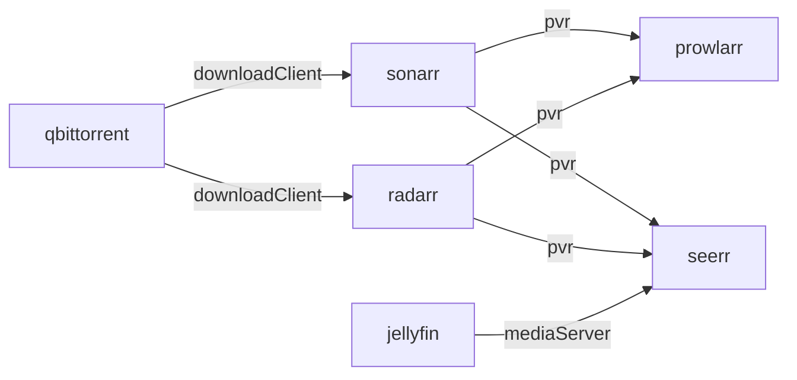

> Status: draft

> Implemented app-side and verified on a live runtime; see "Implementation status" at the end.
> No framework files were changed; the two candidate framework changes are listed in §9.

# Plan: Wire the media stack end to end (Sonarr / Radarr / qBittorrent / Prowlarr / Seerr)

## Problem

The five apps install, converge and authenticate, but they are **not connected to
each other**: a user who installs Sonarr still has to add a download client by hand, and
Seerr can take requests it can never fulfil. Verified on the live `bloud-dev` runtime
through each app's own API:

| Link | Declared in catalog | Wired | Evidence |
|---|---|---|---|
| Seerr → Jellyfin | yes (`mediaServer`) | **yes** | `GET /api/v1/settings/jellyfin` → `{ip: apps-jellyfin, port: 8096, serverId, apiKey(32), libraries: [Movies✓, Shows✓]}` |
| Sonarr/Radarr → qBittorrent | no | no | `GET /api/v3/downloadclient` → `[]` |
| Prowlarr → Sonarr/Radarr | no | no | `GET /api/v1/applications` → `[]` |
| Seerr → Radarr/Sonarr | no | no | `GET /api/v1/settings/radarr\|sonarr` → `[]` |
| Sonarr/Radarr root folder | n/a | no | `GET /api/v3/rootfolder` → `[]` (the `/shows`, `/movies` mounts exist, unregistered) |

Reachability and credentials are already in place, so the manual path works today: all six
containers share `apps-net` (from inside Sonarr, `http://apps-qbittorrent:8081/api/v2/app/version`
and `http://apps-jellyfin:8096/System/Info/Public` both answer `200`), qBittorrent needs no
credentials from that network (subnet whitelist), Servarr API keys live in
`<BLOUD_DATA_DIR>/<app>/config/config.xml`, and `/downloads` is literally the same volume in
Sonarr, Radarr and qBittorrent (identical `st_dev:inode`) so atomic moves/hardlinks work.

## Framework discipline (constraint on this plan)

**No orchestrator, engine, store or `pkg/configurator` contract change.** Cross-app wiring is
app-side, following the precedents already in the tree:

| Need | App-side mechanism | Precedent |
|---|---|---|
| "Is my provider installed?" | the resolved `integrations:` binding (`binding.Installed`) | see the landed follow-up below: the port probes this plan was written with were replaced in the same release |
| Provider base URL to *store* in config | the same binding's `BaseURL` (`http://<node>:<port>`); container names are `apps-<name>` (invariant 12) | `apps/seerr` stores `apps-jellyfin`; Immich/AFFiNE use container DNS in env |
| Provider credentials | the contract payload's credential field, from the provider's `provides.<contract>.secrets` declaration plus `AppSecretsProvider.SetAppSecret` | `apps/hermes` reads affine-mcp's generated token from the host store |
| Ordering + retries after a provider appears | declarative `integrations:` metadata → `computeAppDeps` builds the edge for an **optional** integration once the provider is installed; the existing staleness re-run re-runs the consumer's `PostStart` when its provider transitions | `pipeline.go:699-756`, `orchestrator.go:803-835` |

The "one cost of staying app-side" this plan originally accepted (each consumer holding its
provider's catalog port as a documented constant, and reading a sibling's config.xml for its
key) was paid off in the follow-up below: bindings carry the address, so no consumer holds a
port, and credentials travel through the host secret store, so no consumer reads a sibling's
file.

The two **candidate framework changes** §9 listed were deliberately out of scope here; F1
(bindings) has since landed as its own change.

## Target graph

Direction rule: **the consumer declares the integration and owns the wiring**, so edges point
consumer → provider and the provider is RUNNING (with its config files on disk) before the
consumer's `PostStart` runs.



Do **not** also declare `prowlarr` as a provider for Sonarr/Radarr: that closes the cycle
`sonarr → prowlarr → sonarr`. Prowlarr owns that configuration direction (it pushes indexers
into the PVRs over their APIs).

## What the engine already gives us (no changes required)

- Nodes are containers (`apps-sonarr`, …); edges come from `computeAppDeps`
  (`IntegrationConfig` bindings **plus optional catalog integrations whose compatible app is
  installed**), mapped through `primaryContainerNode` (`pipeline.go:699-756`).
- `collectWorkForLevel` queues a node only when all dependencies are RUNNING or completed this
  pass, so levels converge bottom-up; one pass wires a chain, provided the edges exist.
- **Staleness re-run**: a RUNNING node whose direct dependency completed a lifecycle this pass
  gets `PostStart` re-run only (`orchestrator.go:803-835`). It returns `false`, so it does not
  cascade; sufficient here because every consumer performs *all* of its outbound wiring in its
  own `PostStart` and needs only its direct providers up.
- `PlanInstall` **skips** an integration with nothing installed when it is not required
  (`plan.go:75-77`), so optional links never force-install anything; no install-closure change
  is needed for this plan.

## Design

### 1. Integration vocabulary (catalog metadata: data only)

| Label | Consumers | Compatible providers | Required | Why optional is right |
|---|---|---|---|---|
| `downloadClient` | sonarr, radarr | qbittorrent | **no** | The PVR wires whatever download client is present |
| `pvr` | seerr, prowlarr | sonarr (`category: tv`), radarr (`category: movies`) | **no** | Prowlarr syncs into the PVRs present; Seerr fulfils requests through them |
| `mediaServer` | seerr | jellyfin | **no** (flip from `required`) | Seerr onboards when a media server exists; nothing force-installs |

Optional also means the **edges only exist once a provider is installed**, which is what makes
the DAG order the work correctly as the user assembles the stack; a future "media stack" bundle
would simply install the members itself (§8).

Labels stay coarse (`pvr` covers Sonarr *and* Radarr, matching the catalog fixtures' existing
vocabulary); a consumer wires every provider listed for a label, so multi-target links need no
per-provider label.

### 2. Per-link wiring

Payloads are the *verified* field sets read from the pinned images
(`/downloadclient/schema`, `/applications/schema`), not guesses.

#### 2.1 Sonarr/Radarr root folder (no siblings)

`GET /api/v3/rootfolder` → when the path is absent, `POST /api/v3/rootfolder {"path":"/shows"}`
(Sonarr) / `"/movies"` (Radarr). Needed for any real use and for Seerr's `activeDirectory`.
Quality profiles need no setup: both images ship `Any, SD, HD-720p, HD-1080p, Ultra-HD,
HD - 720p/1080p` (ids 1-6, verified).

#### 2.2 Sonarr/Radarr → qBittorrent

Provider discovery: probe `http://localhost:8081/api/v2/app/version` (200 = qBittorrent is up;
it is unauthenticated for the container/host network by design). Absent → skip, and prune any
previously added client.

`GET /api/v3/downloadclient`; when no entry has `implementation == "QBittorrent"`,
`POST /api/v3/downloadclient`:

```json
{"name":"qBittorrent","implementation":"QBittorrent","configContract":"QBittorrentSettings",
 "protocol":"torrent","priority":1,"enable":true,"tags":[],
 "fields":[{"name":"host","value":"apps-qbittorrent"},
           {"name":"port","value":8081},
           {"name":"useSsl","value":false},
           {"name":"urlBase","value":""},
           {"name":"username","value":""},
           {"name":"password","value":""},
           {"name":"tvCategory","value":"tv-sonarr"}]}
```

Radarr is identical with `movieCategory` (Sonarr's field name in the same `QBittorrentSettings`
contract). Then `POST /api/v3/downloadclient/test` with the same body and require success: that
call is what proves the qBittorrent subnet whitelist plus empty credentials actually
authenticate. **Fallback if it fails:** generate a qBittorrent WebUI password
(PBKDF2-HMAC-SHA512, 100 000 iterations, 16-byte salt, 64-byte key, stored as
`WebUI\Password_PBKDF2="@ByteArray(<salt>:<key>)"`) and pass `username=admin` + that password.

Categories: keep the vendor defaults (`tv-sonarr`, `movie-radarr`); verify in the integration
test that qBittorrent creates a category on first use, otherwise call
`POST /api/v2/torrents/createCategory`.

#### 2.3 Prowlarr → Sonarr/Radarr

Provider discovery: probe `localhost:8989`/`localhost:7878` (`/ping`), read each PVR's API key
from `<BloudDataPath>/<id>/config/config.xml`. Absent → skip (and prune a stale application).

`GET /api/v1/applications`; when absent, `POST /api/v1/applications`:

```json
{"name":"Sonarr","implementation":"Sonarr","configContract":"SonarrSettings",
 "syncLevel":"fullSync","tags":[],
 "fields":[{"name":"prowlarrUrl","value":"http://apps-prowlarr:9696"},
           {"name":"baseUrl","value":"http://apps-sonarr:8989"},
           {"name":"apiKey","value":"<Sonarr config.xml ApiKey>"}]}
```

`syncCategories`/`animeSyncCategories` keep their schema defaults (verified:
`[5000,5010,5020,5030,5040,5045,5050,5090]` / `[5070]`). The schema defaults for
`prowlarrUrl`/`baseUrl` are `http://localhost:*`, which inside the Prowlarr container resolves to
Prowlarr itself, so both URLs must be set explicitly. Then `POST /api/v1/applications/test`.

#### 2.4 Seerr → Radarr/Sonarr

Provider discovery: same probes + API keys as 2.3. `GET /api/v1/settings/radarr|sonarr`
(admin `X-API-Key`); when absent, `POST`:

```json
{"name":"Radarr","hostname":"apps-radarr","port":7878,"apiKey":"<radarr key>",
 "useSsl":false,"baseUrl":"","activeProfileId":4,"activeProfileName":"HD-1080p",
 "activeDirectory":"/movies","isDefault":true,"is4k":false,"syncEnabled":true,"tags":[]}
```

Sonarr adds `seriesType:"standard"`, `animeSeriesType:"standard"`, `enableSeasonFolders:true`
and `activeDirectory:"/shows"`. Prerequisites come from the DAG, not luck: the PVR is RUNNING
before Seerr's `PostStart` (edge ordering) and §2.1 created the root folder in that same pass;
`activeProfileId` comes from the PVR's own `/api/v3/qualityprofile` (lookup `HD-1080p`, fall
back to the first profile).

#### 2.5 Host-dependent Seerr URLs (optional, later)

`main.applicationUrl` and `jellyfin.externalHostname` are the two absolute URLs Seerr stores.
They need the same treatment host-set changes give SSO apps; until then they stay user-settable
(documented in `apps/seerr/INTEGRATION.md`).

### 3. Failure, prune and idempotency rules

- **Provider not present** → skip that link, log at Info, never fail the node. The next
  reconciliation (or the provider's own staleness trigger) picks it up.
- **Provider present but its API rejects or is unreachable** → error naming the sibling and the
  endpoint; the node goes ERROR (a real misconfiguration, not a race).
- **Previously wired provider gone** → prune the stale entry (remove the download client /
  Prowlarr application / Seerr DVR) so uninstall does not leave dead targets pointing at a
  hostname that no longer resolves.
- Every step is GET → compare → write only on difference, with `AlreadyDone` classification for
  duplicate/"already configured" responses, and the whole `PostStart` fits the 150 s budget.

### 4. Tests

- **Unit** per link with `httptest` fakes on both sides: payload shape, idempotent second run (no
  `POST`), prune, provider-absent skip, mirrored provider credentials from fixture files.
- **Integration tier**: new `services/host-agent/internal/e2e/media_stack_test.go` (build tag
  `integration`) installing the stack through the real API and asserting with the apps' own
  APIs: Sonarr/Radarr `downloadclient` non-empty **and** `/downloadclient/test` ok, Prowlarr
  `applications` non-empty, Seerr `settings/radarr|sonarr` non-empty, root folders present.
- **Playwright**: extend `seerr.spec.ts` with a rung asserting Seerr's Services settings list the
  PVRs (user-visible proof); the API-level contract stays in the integration tier.

### 5. Rollout on existing installs

There is no desired-state invalidation today (§9 F2), so an already-RUNNING app does not re-run
`PostStart` on its own. The existing, already-verified trigger is a full lifecycle pass:
`./bloud dev` removes and recreates managed containers on start, which re-runs `PostStart` for
every app (confirmed in the host-agent log: `lifecycle phase: PostStart` for all six apps).
`uninstall` + `install` of an app does the same for that app; installing a *provider* later
re-runs its consumers through the staleness path.

### 6. Phases

| Phase | Change | Files | Acceptance |
|---|---|---|---|
| 1 | Root folders | `apps/sonarr` + `apps/radarr` configurators | `/api/v3/rootfolder` non-empty; idempotent |
| 2 | Download client | `pkg/servarr` + both PVR configurators | `downloadclient` has qBittorrent; `test` ok; prunes when absent |
| 3 | Prowlarr app sync | `apps/prowlarr` | `applications` has Sonarr+Radarr; `test` ok |
| 4 | Seerr PVRs | `apps/seerr` | `settings/radarr|sonarr` non-empty |
| 5 | Metadata + docs | five `metadata.yaml`, `INTEGRATION.md`s, this plan | optional links declared; depgraph shows the edges when providers are installed |

Phases 1-4 are independent; 4 depends on 1 only at runtime (guaranteed by the DAG).

## 7. Risks

1. **Empty qBittorrent credentials through the Servarr client**: the single real unknown.
  Mitigated by requiring `/downloadclient/test` to pass, with the documented PBKDF2 fallback.
2. **Per-consumer provider constants** (port numbers) duplicate catalog metadata. Mitigation:
  documented in each `INTEGRATION.md`; removed by F1 if that framework change is ever approved
  (**resolved**: F1 landed 2026-09-21, so the constants are gone and the address comes from the
  binding).
3. **Half-wired stacks look healthy**: a node with no provider runs fine and shows no "not wired
  yet" signal. Consider surfacing it in a follow-up (UI/status), not here.
4. **API surface drift**: Sonarr/Radarr `/api/v3`, Prowlarr `/api/v1`; pinned image tags keep the
  verified field sets stable; re-verify payloads on any tag bump.

## 8. Future: a logical "media stack" app

The product direction is a single catalog concept ("media stack") that installs and presents the
five apps as one thing. This plan deliberately leaves the seam for it: because every link is an
*optional* integration, a bundle can declare the members itself and the wiring lights up with no
change to the automations above. What a bundle needs (separate design):

- a catalog-level bundle concept (members, one tile/home-screen entry); the graph stays
  container-centric by invariant 4, so this is presentation + install expansion, not a new node
  type;
- install-intent expansion into N member installs (a `required`-style "install these" list, which
  is the same path `PlanInstall`'s `Choices` already models);
- user integration choices being honoured (`review.md §H3`), which is what a bundle would use to
  pick providers.

## 9. Framework candidates (NOT in this plan: need an explicit decision)

| # | Change | Why it would help | Why this plan does not need it | Cost |
|---|---|---|---|---|
| F1 | Pass resolved provider addresses/bindings into `configurator.AppState` (`pkg/configurator` + orchestrator resolver) | removes per-consumer port constants; one source of truth for "where is my provider" | probes + `apps-<id>:<port>` already work and are precedented; constants are static and documented | contract change + resolver + tests | **LANDED 2026-09-21** (see "Follow-up" below) |
| F2 | Desired-state invalidation: store a per-app digest (catalog metadata + bindings + SSO strategy) and reset nodes when it changes | new wiring activates automatically on existing installs instead of needing a manual full-lifecycle pass | rollout is solved by the existing `./bloud dev` recreate path (§5) and by provider-driven staleness | store migration + digest + reset path + tests |
| F3 | A bind address on `catalog.ContainerPort` (and a `hostIP` in `podman.PortMapping`), so a published port can be bound to loopback instead of `0.0.0.0` | these apps have **no app-side authentication** (Servarr `External` mode, qBittorrent's subnet whitelist), so the published port is an unauthenticated admin surface on every interface of the machine running host-agent; verified live: `podman port apps-qbittorrent` → `8081/tcp -> 0.0.0.0:8081`, `ss` → `*:8081`. Traefik runs on the host network and reaches apps through `localhost:<port>`, so a loopback bind would keep the product path working | the dev VM forwards published ports to host loopback only, so the exposure is invisible there and inherent to real deployments | catalog + engine + podman client fields + docs |
| F4 | Make `appclient.Call.Timeout` real (it is a write-only field today, so a per-call override never reaches the request) | four sibling probes ask for a 5 s ceiling and silently get the client's 15 s default; the tech-debt ledger already records it | the probes now bound themselves with a context deadline instead | small fix + test in `pkg/appclient` |
| F5 | Validate `sso.strategy` against its enum at catalog load (`internal/catalog/loader.go` only checks `bypassPaths`) | with these apps' own auth disabled, a typo such as `forwardauth` loads cleanly, provisions no middleware, and yields an unauthenticated admin UI | the five new entries are correct and pinned by unit tests | a few lines in `validateApp` |
| F6 | Make the forward-auth apps' no-auth state conditional on a *resolved* provider (`sso: required: true`, or a configurator guard) | the middleware is only generated while Authentik is installed, so losing that catalog row leaves an app that has disabled its own login with nothing in front of it (a fail-open coupling, shared with `apps/navidrome`) | Authentik is installed as system infra at the first convergence, so the window is bounded | metadata + configurator guards |

All are additive and independent of this work; each needs its own rationale, tests and review.

## Implementation status (2026-09-19)

Landed app-side, no framework files touched: the four metadata declarations (§1), the wiring in
`apps/sonarr`, `apps/radarr`, `apps/prowlarr`, `apps/seerr` (plus `pkg/servarr` helpers), the
integration-tier test `services/host-agent/internal/e2e/media_stack_test.go`, and per-app
`INTEGRATION.md` updates. Verified on the live runtime through each app's own API:

| Link | Verified |
|---|---|
| Sonarr/Radarr → qBittorrent | `downloadclient` lists `QBittorrent` (`apps-qbittorrent:8081`, categories `tv-sonarr`/`movie-radarr`), `downloadclient/test` 200; the categories exist in qBittorrent |
| Sonarr/Radarr root folders | `/api/v3/rootfolder` = `/shows` and `/movies` |
| Prowlarr → Sonarr/Radarr | `applications` lists both (`prowlarrUrl`/`baseUrl` in-network, `fullSync`), `applications/test` 200 for both |
| Seerr → Radarr/Sonarr | `settings/radarr|sonarr` each hold one entry (HD-1080p, `/movies` · `/shows`, `syncEnabled`) |
| Seerr → Jellyfin | unchanged from the earlier verification |

Two behaviours were only discoverable against the real apps and are now encoded:

1. **qBittorrent does not create categories on demand** (`TorrentImpl::setCategory` refuses an
   unknown category), so the PVR creates its own category before adding the client
   (`POST /api/v2/torrents/createCategory`, duplicate = 409 = already done).
2. **The media library must be world-writable.** Sonarr/Radarr import as LSIO's `abc`
   (PUID=1000 → a host subuid under rootless podman), so a 0755 host directory is rejected as a
   root folder ("not writable by user 'abc'"); their `PreStart` now chmods `media/shows`
   respectively `media/movies` 0777, the same treatment `apps/authentik` and `apps/seerr` use.

Two further field-level facts came from live calls and are documented in the apps' code:
Prowlarr's `applications/test` validates the document's name against existing entries (test
before create), and Prowlarr masks `apiKey` as `********` on read (a masked value must count as
matching, or the entry is recreated every pass).

Rollout note: with no desired-state invalidation (F2), an already-RUNNING app re-runs `PostStart`
on the next full lifecycle, `./bloud dev` (which recreates managed containers) or an
app reinstall. That is how the stack above was wired.

### Post-review fixes (2026-09-19)

A deep review of the landed commit (five independent reviewers plus a re-audit of every claim)
found defects that the live verification could not see, because it only ever ran on a fresh
install, through the full suite, and from the trusted side. All of them are fixed app-side:

1. **The config dir was not writable after first boot.** `pkg/managedfile` writes `config.xml`
   through a temp file *inside* `<appDataDir>/config`, and the container's init chowns that
   directory to LSIO's `abc` (a host subuid), so the next auth repair failed with EACCES,
   `PreStart` failed, and ERROR being terminal parked the node with no way back. The Servarr
   `PreStart`s now chmod the config dir 0777 (as `apps/seerr` always did), and the downloads
   trees with it: LSIO chowns only `/config`, so `/downloads` and `/downloads/incomplete`
   stayed unavailable to the importing user. qBittorrent's conf is rewritten in place
   (`os.Create`), so its *file* mode has to be opened up too.
2. **Three of the ten CI legs could not pass.** The catalog rung matched a card by its whole
   text, so Prowlarr's description (which names the PVRs it syncs to) resolved it to
   Prowlarr's card in the sonarr/radarr legs; the Seerr leg installed no media server, so the
   instance stayed un-onboarded and its last rung failed. The rung now matches the card title,
   and Seerr's spec installs Jellyfin as its prerequisite.
3. **An unanswerable provider was treated as an uninstalled one.** Availability is a 5 s probe,
   so a restarting provider erased the wired entry (and, matching on the implementation alone,
   deleted an operator's own qBittorrent clients with it). Identity is now the coordinates
   Bloud writes (`apps-qbittorrent:8081`; Prowlarr matches implementation + `baseUrl`), a
   foreign entry is never pruned, and Bloud's entries carry a reserved name so a name
   collision cannot block its own wiring.
4. **A transient sibling failure parked a node in terminal ERROR.** The orchestrator never
   retries an ERROR node, so a 5xx or a connection reset now keeps the app RUNNING and is
   retried on the next reconciliation; only a rejection (4xx) is an error.
5. **A stale sibling key was undetectable.** Prowlarr masks `apiKey` on read, so a PVR that was
   purged and reinstalled silently 401'd forever. The instance's own `applications/testall`
   verdict now drives a repair, and drift is repaired with `PUT /applications/{id}` instead of
   delete + create (which discarded the operator's name and tags). Seerr's analogous case (a
   Jellyfin key that outlived the server) is now detected by use and re-issued.
6. **Prowlarr's stored-entry verification is lazy** (it costs a live connection test per entry)
   and the download-client create is no longer retried (the Servarr validator makes a retry a
   `400 Should be unique`), and a `null` list is rejected rather than treated as empty.

## Follow-up landed 2026-09-21: integration bindings (F1)

The two mechanisms this plan accepted as its app-side cost are gone, both replaced by F1.

**What changed.** Integration contracts are first class. `internal/catalog/contracts.go` defines
each one: the label a consumer declares, the secret names a provider must publish for it and the
values it must declare. A provider offers a contract in its metadata
(`provides: {pvr: {secrets: [apiKey]}}`) and the catalog loader rejects a declaration that does not
match; the orchestrator resolves each declared contract into a *typed slice* in
`configurator.AppState.Integrations` (`PVRs`, `MediaServers`, `DownloadClients`, `MCPServers`,
`SSO`), each binding embedding `ProviderRef` (`App`, `Installed`, `Node`, `Port`, `BaseURL` as
`http://apps-<id>:<port>` for what the app stores, and `LocalURL` as `http://localhost:<port>` for
the configurator's own calls) plus that contract's payload (`PVRBinding.APIKey`,
`MediaServerBinding.AdminPassword`, `MCPBinding.URL`, ...). Credentials travel through the host
secret store (`AppSecretsProvider.SetAppSecret`); endpoint facts travel in the metadata. A
consumer declares what it reads (`integrations.<contract>.requires`), and only that is resolved: a
contract's credentials are not handed to every app that integrates with it, so declaring `sso` no
longer delivers the identity provider's admin API token to apps that only needed to be
authenticated. The
bindings for a contract mirror `computeAppDeps`, so they never describe a provider the graph does
not order.

Replaced by it:

| Was | Now |
|---|---|
| `pkg/servarr.SiblingConfigPath` + `APIKey`: Prowlarr and Seerr read `<dataDir>/<pvr>/config/config.xml` for the PVR's key | `PVRBinding.APIKey`; `apps/sonarr`/`apps/radarr` publish it under their `pvr` contract from `PreStart` (adopted from their own config.xml, so a UI-regenerated key is re-published) |
| `apps/navidrome` read `<dataDir>/authentik/api-token` (ledger item C12) | `SSOBinding.APIToken`; `apps/authentik` publishes it under its `sso` contract. The file stays, because the host's own tooling reads it (`config.getAuthentikToken`, the CLI and e2e helpers) |
| Seerr logged into Jellyfin with `GenerateAppAdminPassword("jellyfin")`, hardcoding the provider id | `MediaServerBinding.AdminPassword`; `apps/jellyfin` declares it under its `mediaServer` contract and the value is the password the host already generates for it |
| Per-consumer provider port constants (`qbittorrentPort`, `sonarrPort`, `radarrPort`) and `apps-<id>` built by hand | `ProviderRef.Port` / `.Node` / `.BaseURL` |
| Availability by port probe (`/ping`, `/api/v2/app/version`, `/System/Info/Public`), where a failed probe meant "not installed" and pruned the wiring | `binding.Installed`, the same condition as the dependency edge. A provider that is installed but not answering is a *transient* failure: the entry is kept and the next reconciliation retries. A probe could not tell "not installed" from "restarting", so it deleted wiring that was still wanted |
| Seerr's prune used a sibling `config.xml` existence check as the "was installed" trace | `Installed: false` prunes, identified by the address Bloud wrote (which the binding still carries from the provider's catalog metadata) |

**Upgrade rollout.** The credentials a consumer reads are published by the provider's `PreStart`,
so on an upgrade an already-RUNNING provider has not published yet: a consumer wired in the same
window sees the binding, logs that the key is not published, and wires nothing until the provider
runs a full lifecycle. This plan's existing rollout note covers it (`./bloud dev` recreates the
managed containers, which re-runs every `PreStart`); the stale-entry repair paths in Prowlarr and
Seerr then converge on their next pass, as they do for any other drift.

**Why the mechanism generalizes.** A contract is the unit: the vocabulary lives once, in
`internal/catalog/contracts.go`, with the label a consumer declares, the secret names a provider
must publish for it and the values it must declare, all validated at catalog load. Providers offer
contracts in their metadata; the orchestrator resolves each into a *typed* slice in
`AppState.Integrations` (`PVRs`, `MediaServers`, `DownloadClients`, `MCPServers`, `SSO`), so a
provider of an existing contract is metadata only, a consumer reads its own payload fields with no
nil checks, and no binding struct grows a field for every capability (the frozen, already-merged
revision had `Secrets map[string]string` plus `MCP *MCPEndpoint` on one struct, which is the shape
this replaced). Adding a contract is a registry entry, a payload type and one resolver arm; the
MCP edge (an MCP server an agent app registers, handed over as `MCPServers[i].URL` with the token
the same provider publishes) is the first contract that carries a non-credential value.

**Consequences for the docs above.** Where §2 says "provider discovery: probe ...", §7 risk 2 or
the post-review notes reference per-consumer constants, or a consumer is said to read a sibling's
config file, the binding mechanism is what shipped. The tables in §1 (integration vocabulary) and
the target graph still describe reality.

**Still open** (unchanged by this): F2–F6, and the rollout note above. F1's own resolver is
covered by `internal/engine/orchestrator/integration_bindings_test.go`, the declaration by
`internal/catalog/provides_test.go`, and the store half (publish, idempotence, no env-file leak)
by `internal/secrets/published_test.go`.
