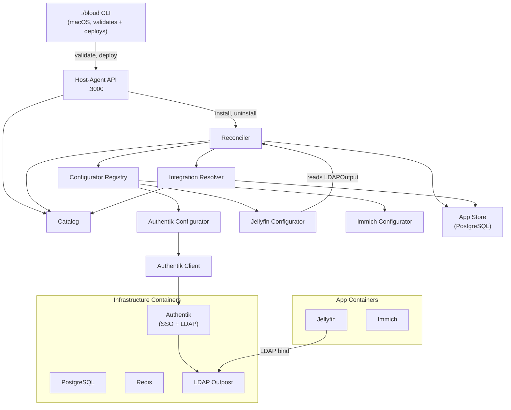

# Portable Runtime Architecture

Bloud is a self-hosted media server that manages apps (Jellyfin, Immich, etc.) on a single
Linux host. The **portable runtime** is the Go binary (`host-agent`) that orchestrates app
lifecycle, configuration, and integration — replacing the previous NixOS-based approach.

## Component Diagram



## Components

### Host-Agent CLI (`services/host-agent/cmd/host-agent/`)

Entry point. Runs as a systemd service (API mode) or executes one-shot configure commands.

| Subcommand | Purpose |
|---|---|
| *(none)* | Start the REST API server on `:3000` |
| `configure prestart <app>` | Pre-start setup (dirs, env files, SSO wait) |
| `configure poststart <app>` | Post-start config (health check, API calls, integrations) |
| `configure reconcile` | Full reconciliation cycle for all installed apps |
| `configure catalog-refresh` | Reload app catalog from disk into DB cache |
| `init-secrets` | Generate and persist initial secrets |

### Catalog (`internal/catalog/`)

Discovers apps by reading `apps/*/metadata.yaml`. Each app declares its name, port,
health check, SSO strategy, and integration requirements. The catalog is cached in
PostgreSQL and refreshed from disk on demand.

### Integration Resolver (`internal/integration/`)

Deterministically resolves which provider app satisfies each consumer's requirements.
Apps declare integrations in `metadata.yaml`:

```yaml
integrations:
  database:
    required: true
    compatible: [{ app: postgres, default: true }]
  sso:
    required: false
    compatible: [{ app: authentik }]
```

Resolution: bound providers are verified for compatibility; unbound required integrations
error; unbound optional integrations try each compatible provider in catalog order.

### Reconciler (`internal/orchestrator/reconcile.go`)

Three-phase, dependency-aware lifecycle loop:

1. **PreStart** — all apps in parallel (directories, env files, config generation)
2. **HealthCheck + PostStart** — apps in topological order by dependency level
3. **Optional transition** — when an optional dependency becomes healthy, reconfig parent apps

All phases are idempotent. The reconciler builds a dependency graph from resolved
integrations and computes levels (level 0 = no deps, level N = deps in levels < N).

### Configurator Framework (`pkg/configurator/`)

Generic interface for app-specific runtime configuration that can't be expressed in
static container definitions (API calls, credential rotation, plugin setup).

```go
type Configurator interface {
    Name() string
    PreStart(ctx context.Context, state *AppState) error
    HealthCheck(ctx context.Context) error
    PostStart(ctx context.Context, state *AppState) error
}
```

**`AppState`** carries typed integration outputs into each configurator:

```go
type AppState struct {
    DataPath      string
    BloudDataPath string
    SSOEnabled    bool
    LDAP          *LDAPOutput  // host, port, baseDN, bindUser, bindPassword
}
```

**Implementations:**
- **Authentik** — sets admin password, ensures API token, creates LDAP infrastructure
- **Jellyfin** — completes setup wizard, creates libraries, configures LDAP plugin
- **Immich** — initializes database, creates admin, configures OIDC

### Authentik Client (`pkg/authentik/`)

Manages the Authentik identity provider via its REST API. Key operation:

**`EnsureLDAPInfrastructure(ldapBindPassword)`** — idempotent setup:
1. Create LDAP provider (direct bind + direct search mode)
2. Create LDAP application
3. Create service account user, add to admin group
4. Create service account API token
5. Set service account password (required for LDAP direct bind)
6. Create LDAP outpost instance

### App Store (`internal/store/`)

PostgreSQL-backed persistence for installed apps, their status, and resolved integration
bindings. The reconciler reads desired state from here; the API writes to it on
install/uninstall.

## Data Flow: Installing an App

```
User clicks "Install Jellyfin"
  → API records intent in App Store
  → Integration Resolver binds Jellyfin→PostgreSQL, Jellyfin→Authentik
  → Reconciler starts reconciliation:
      Level 0: PostgreSQL, Redis (no deps)
        → PreStart → HealthCheck → PostStart
      Level 1: Authentik (depends on PostgreSQL, Redis)
        → PreStart → HealthCheck → PostStart (creates LDAP infra)
      Level 2: Jellyfin (depends on Authentik for SSO)
        → PreStart → HealthCheck → PostStart (wizard, libraries, LDAP config)
  → All apps healthy, LDAP login works
```

## Validation Tiers

| Tier | Scope | How |
|---|---|---|
| `fast` | Unit tests, type checks | `go test`, `vitest` — seconds |
| `integration` | Backend plumbing against real services | Go tests in Lima VM against Podman compose stack |
| `vm` | Full ISO on real hardware | Deploy to Proxmox, Playwright smoke tests |

Run with: `./bloud validate --tier <tier>`

## Dev Environment

Lima VM (Debian, Apple Virtualization) + Podman Compose mirrors production:

```
macOS host
  └── Lima VM "bloud-dev"
        ├── podman-compose (dev/compose.yml)
        │   ├── PostgreSQL :5432
        │   ├── Redis
        │   ├── Authentik  :9000
        │   ├── LDAP Outpost :3389
        │   └── Jellyfin   :8096
        └── host-agent binary (built from source)
```

Ports forward to macOS for Playwright and manual testing.
