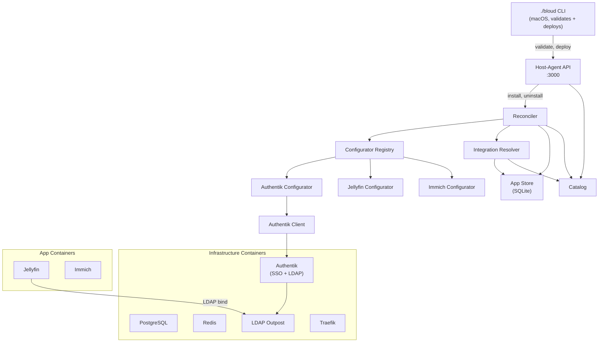

# Portable Runtime Architecture

Bloud manages apps (Jellyfin, Immich, etc.) on a single Linux host. The **portable
runtime** is the Go binary (`host-agent`) that orchestrates app lifecycle, configuration,
and integration via Podman Quadlet units and systemd.

## Component Diagram



## Components

### Host-Agent CLI (`services/host-agent/cmd/host-agent/`)

Entry point. Runs as a systemd user service (API mode) or executes one-shot configure
commands.

| Subcommand | Purpose |
|---|---|
| *(none)* | Start the REST API server on `:3000` |
| `configure prestart <app>` | Pre-start setup (dirs, env files, SSO wait) |
| `configure poststart <app>` | Post-start config (health check, API calls, integrations) |
| `configure reconcile` | Full reconciliation cycle for all installed apps |
| `configure catalog-refresh` | Reload app catalog from disk into DB cache |
| `init-secrets` | Generate and persist initial secrets |

### Catalog (`internal/catalog/`)

Discovers apps by reading `apps/*/metadata.yaml`. Each app declares its name, port,
health check, SSO strategy, integration requirements, and container spec. The catalog is
cached in SQLite and refreshed from disk on demand.

### Integration Resolver (`internal/integration/`)

Deterministically resolves which provider app satisfies each consumer's requirements.
Apps declare integrations in `metadata.yaml`:

```yaml
integrations:
  database:
    required: true
    compatible: [{ app: postgres, default: true }]
  sso:
    required: false
    compatible: [{ app: authentik }]
```

Resolution rules:
1. If a provider binding already exists in `InstalledApp.IntegrationConfig`, resolve it.
2. For optional integrations with no binding, select the first installed compatible
   provider in catalog order.
3. A required integration with no binding is invalid and returns an error.
4. Unbound optional integrations with no installed compatible provider produce no binding.

### Reconciler (`internal/orchestrator/intent.go`)

All mutations flow through a typed intent queue with debounce. The orchestrator
is the single writer to all stores and the single executor of all side effects.

Intent types:
- **InstallAppIntent** — install an app by name
- **UninstallAppIntent** — remove an app (with optional `clearData`)
- **RenameAppIntent** — change an app's display name
- **TailnetIntent** — tailnet configuration changes
- **RemoteAppsIntent** — remote app management
- **SharesIntent** — sharing lifecycle
- **ClearDataIntent** — wipe app data

The orchestrator drains the intent queue, processes intents in dependency order,
and converges the actual state to match desired state. All phases are idempotent.

```go
type Intent interface {
    intentMarker()  // sealed interface
    IntentID() string
}
```

### Configurator Framework (`pkg/configurator/`)

Generic interface for app-specific runtime configuration that can't be expressed in
static container definitions (API calls, credential rotation, plugin setup).

```go
type Configurator interface {
    Name() string
    PreStart(ctx context.Context, state *AppState) error
    HealthCheck(ctx context.Context) error
    PostStart(ctx context.Context, state *AppState) error
}
```

**`AppState`** carries typed integration outputs into each configurator:

```go
type AppState struct {
    DataPath      string
    BloudDataPath string
    SSOEnabled    bool
    LDAP          *LDAPOutput  // host, port, baseDN, bindUser, bindPassword
}
```

**Implementations:**
- **Authentik** — sets admin password, ensures API token, creates LDAP infrastructure
- **Jellyfin** — completes setup wizard, creates libraries, configures LDAP plugin
- **Immich** — initializes database, creates admin, configures OIDC

### Authentik Client (`pkg/authentik/`)

Manages the Authentik identity provider via its REST API. Key operation:

**`EnsureLDAPInfrastructure(ldapBindPassword)`** — idempotent setup:
1. Create LDAP provider (direct bind + direct search mode)
2. Create LDAP application
3. Create service account user, add to admin group
4. Create service account API token
5. Set service account password (required for LDAP direct bind)
6. Create LDAP outpost instance

### App Store (`internal/store/`)

SQLite-backed persistence for installed apps, their status, and resolved integration
bindings. The reconciler reads desired state from here; the API writes to it on
install/uninstall. Schema lives in `internal/db/schema.sql`.

### Container Runtime (`internal/container/`, `internal/orchestrator/`)

Apps run as Podman containers managed by Quadlet systemd units. The orchestrator writes
`.container` unit files to `~/.config/containers/systemd/`, triggers `systemctl --user
daemon-reload`, and starts/stops units via the systemd D-Bus API.

Container specs are defined in `metadata.yaml` under the `container:` key and rendered
with template variables (data paths, passwords, etc.) at install time.

## Data Flow: Installing an App

```
User clicks "Install Jellyfin"
  → API submits InstallAppIntent to the intent queue
  → Integration Resolver binds Jellyfin→PostgreSQL, Jellyfin→Authentik
  → Orchestrator drains intent queue:
      1. Build dependency graph from resolved integrations + metadata dependsOn
      2. For each container node (topological order):
         a. PreStart (configurator, if registered)
         b. Resolve template variables → build container spec
         c. Ensure container (create/start, idempotent via spec hash)
         d. Wait for health check (from container metadata)
         e. PostStart (configurator, if registered)
         f. Mark node RUNNING
      3. Traefik routes regenerated
  → All apps healthy, LDAP login works
```

## Validation Tiers

| Tier | Scope | Command |
|---|---|---|
| `fast` | Unit tests, type checks | `./bloud validate --tier fast` |
| `integration` | Backend against real services in Lima VM | `./bloud validate --tier integration` |

## Dev Environment

Lima VM (Debian, Apple Virtualization) + rootless Podman:

```
macOS host
  └── Lima VM "bloud-dev"
        ├── Podman (rootless)
        │   ├── PostgreSQL
        │   ├── Redis
        │   ├── Authentik + LDAP Outpost
        │   ├── Traefik  :8080
        │   └── App containers (Jellyfin, Immich, etc.)
        └── host-agent binary (:3000, systemd user service)
```

Ports 3000 and 8080 are forwarded to macOS localhost by `./bloud dev`.
