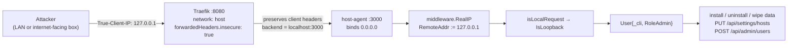

# Bloud: Architectural & Code Review (2026-09-19)

**Reviewer:** architecture/code review (9 parallel subsystem audits, findings re-verified at source)
**Scope:** whole repository: `services/host-agent/`, `apps/`, `cli/`, `services/host-agent/web/`, `e2e/`, CI, docs
**Code under review:** `82aa5a1` ("Remove port-80 front proxy and mDNS announcer; keep multi-host model (#90)")
**Size:** ~51.6k Go LOC / 248 Go files (excluding `.claude/worktrees/`), 81 frontend files

> **This is a dated snapshot, not the debt ledger.**
> The single living ledger for backend debt and its repayment plan remains
> [`docs/operations/tech-debt.md`](../operations/tech-debt.md). New findings go
> there; this file records the state of the system as reviewed on 2026-09-19.
> Findings below that contradict an entry in the ledger or in
> [`review.md`](review.md) are called out explicitly.

---

## 0. Verdict

The **architecture is right**: declarative desired-state, a typed intent queue
with a single writer, topological lifecycle levels, idempotent configurators,
pure route generation, pinned-asset provenance. That design is implemented, not
just documented, and it is the correct foundation for this product.

The **implementation has one critical security hole, one silent-failure class in
the engine core, and a durability/honesty gap**. Concretely: a remote,
unauthenticated admin bypass that needs one header; three independent paths that
kill the process (`panic`, `fatal error`, `fatal error`); an intent loop that can
exit permanently while `/api/health` still reports healthy; and a store layer
whose foreign-key cascades are off on most pooled connections.

Fix order matters. **P0-1 is a shipping blocker and should be fixed first**: it
is a one-header, no-credential root-of-appliance compromise reachable on the
documented public port. Everything else is recoverable; that one is not.

---

## 1. Method & verification status

Read in full or in part: `internal/engine/{orchestrator,graph}`, `internal/api/*`,
`internal/store/*`, `internal/catalog/*`, `internal/sso/*`,
`internal/{sharing/token.go,config,schema,secrets,netutil,container,appconfig}`,
`pkg/*`, `apps/*/{metadata.yaml,configurator.go,api.go}`, `cli/*`,
`.github/workflows/*`, `.forgejo/workflows/*`, `.husky/*`, `validation.yaml`,
`AGENTS.md`, `README.md`, `docs/**`.

Executed (not merely read):

| Check | Result |
|---|---|
| `go build ./...` / `go vet ./...` (host-agent) | clean |
| `go test ./...` host-agent (24 packages) | all `ok` |
| `go test ./...` apps | all `ok` |
| `go test ./...` cli | **FAIL**: `TestResolveBackendPrecedence` |
| `golangci-lint v2.13.2` (cli, cyclop ≤ 20) | `0 issues` |
| chi v5.2.3 duplicate-route precedence | empirical repro: **last registration wins** |
| `hass-oidc-auth` v1.2.1 release `manifest.json` | fetched: `"version": "1.2.1"` |

Live-environment check: the `bloud-dev` Lima VM is running but **host-agent is
not** (Traefik `:8080` returns 502), so P0-1 is verified by a complete source
chain (quoted below), not by a live exploit. Everything else marked *verified*
was confirmed by reading the cited lines; items marked *[INFERENCE]* are reasoned
from verified code structure and say so.

---

## 2. P0: Remote unauthenticated admin via one spoofed header

### Where (five files compose the hole)

| # | Location | Fact |
|---|---|---|
| 1 | `apps/traefik/metadata.yaml:15-16` | `apps-traefik` runs `network: host` |
| 2 | `internal/appconfig/traefik.go:109` | upstream is `http://localhost:<hostAgentPort>` |
| 3 | `internal/appconfig/traefik.go:76-80` | entrypoint `web` sets `forwardedHeaders: insecure: true` |
| 4 | `internal/appconfig/traefik.go:118-121` | router `host-api` = `PathPrefix('/api')`, priority 90, on the public entrypoint |
| 5 | `internal/api/router.go:236` | `r.Use(middleware.RealIP)`: global, runs before the `/api` subtree |
| 6 | `internal/api/auth_module.go:99-124` | `isLocalRequest` → `ip.IsLoopback()` → `true` |
| 7 | `internal/api/router.go:546-550` | loopback ⇒ `store.User{Username:"_cli", Role: store.RoleAdmin}`, no credential |

### Mechanism

Traefik's `XForwarded.ServeHTTP` sanitizes client-supplied forwarding headers
**only when `!insecure`**:

```go
// traefik/pkg/middlewares/forwardedheaders/forwarded_header.go
if !x.insecure && !x.isTrustedIP(r.RemoteAddr) {
    DeleteXForwardedHeaders(r.Header)
}
```

With `insecure: true` that deletion is skipped, so client-supplied `X-Real-Ip` /
`X-Forwarded-*` survive untouched (`rewrite` only *sets* `X-Real-Ip` when absent).
`True-Client-IP` is not a Traefik-managed header at all, and chi checks it first:

```go
// github.com/go-chi/chi/v5@v5.2.3/middleware/realip.go
if tcip := r.Header.Get(trueClientIP); tcip != "" { ip = tcip }
else if xrip := r.Header.Get(xRealIP); xrip != "" { ip = xrip }
else if xff := r.Header.Get(xForwardedFor); xff != "" { ip, _, _ = strings.Cut(xff, ",") }
...
r.RemoteAddr = rip
```

`isLocalRequest` then parses `RemoteAddr`, sees `127.0.0.1`, and the middleware
mints an admin identity: no cookie, no token, no network position required.



### Exploit

```bash
# through the documented public port
curl -X POST -H 'True-Client-IP: 127.0.0.1' -H 'Content-Type: application/json' \
     -d '{"clearData":true}' http://<box>:8080/api/apps/immich/uninstall

# or straight at host-agent (also works with X-Real-Ip / X-Forwarded-For)
curl -H 'X-Real-IP: 127.0.0.1' http://<box>:3000/api/apps/installed
```

Full appliance control: install/uninstall/wipe app data, `PUT /api/settings/hosts`,
tailnet auth keys, `POST /api/admin/users` (then persist as a real Authentik
admin), shares, remote apps, and `POST /api/apps/refresh-catalog` (see P1-2:
that request also kills the process).

### Why the ledger understates it

`docs/operations/tech-debt.md` ranks this first but frames it as *"network
position is the credential"*: a local-process problem, P2 in `review.md` §H1.
The spoofable header removes the network-position requirement entirely, and the
product's own Traefik config (`insecure: true`) supplies the enabling condition.
This is not a hardening item; it is the whole authorization model.

### Fix (all four, in order)

1. Drop `middleware.RealIP`, or replace it with a resolver that honours
   forwarding headers only when the immediate peer is a configured trusted proxy
   and that takes the right-most non-trusted hop.
2. Require an unforgeable credential for the loopback path: a per-boot token in a
   `0600` file under `BLOUD_DATA_DIR` that the CLI reads; the `ReadRuntimeFile`
   backend seam already carries files across Lima/QEMU/native.
3. Bind host-agent to loopback (or a dedicated socket) and let only Traefik reach it.
4. Replace `forwardedHeaders.insecure: true` with `forwardedHeaders.trustedIPs`
   limited to Traefik's own address.

### Fix surface (measured)

`r.RemoteAddr` has exactly **two** consumers in all of host-agent, both inside
`isLocalRequest` (`auth_module.go:100,102`), and the forwarded-header surface is
**three** reads total, all in the same file:

| Consumer | Line | Note |
|---|---|---|
| `r.RemoteAddr` via `net.SplitHostPort` | `auth_module.go:100-102` | the trust decision itself |
| `X-Forwarded-Host` | `auth_module.go:135` | OAuth redirect URI / logout redirect (see P1-5) |
| `X-Forwarded-Proto` | `auth_module.go:161` | scheme for the same URL building |

Nothing else uses client IP: no rate limiting, no source-keyed audit log. So
`middleware.RealIP` can be deleted with no behavioural regression beyond the
bypass itself, and `requestHost`/`requestBaseURL` can be rebuilt from
`hostset.State.AllBaseURLs()` / the primary host (`initAuthHelper` already
computes exactly that set at `router.go:494-508`). Roughly a 15-line change in one
file plus the Traefik entrypoint config, removing all three header-trust sites at
once: the highest-value change in the repo.

Caveat when doing it: removing `X-Forwarded-Proto` trust means the real scheme
must still reach host-agent. Either narrow `trustedIPs` to Traefik's address, or
hardcode `http`, which matches reality: invariant 10 says no TLS ships today.

---

## 3. P1 findings

### P1-1 `SyncContainerState` nil-deref kills the process

**Where:** `internal/engine/orchestrator/orchestrator_containers.go:41-45`

```go
catalogApp, err := o.catalog.Get(app.CatalogID)
defs := catalogApp.ContainerDefs()          // deref BEFORE the err check
if err != nil || len(defs) != 1 { continue }
```

**Mechanism:** `MemoryCache.Get` returns `(nil, error)` on a miss
(`catalog/cache.go:50-53`); `ContainerDefs()` has a pointer receiver returning
`a.Containers` (`catalog/models.go:57-59`), so a nil `catalogApp` is a
nil-pointer dereference. A miss is production-reachable: `Loader.LoadAll`
silently `continue`s past any directory lacking `metadata.yaml`
(`catalog/loader.go:43-45`) and `Refresh` replaces the whole map, so removing or
renaming an app directory while its store row survives drops it from the cache.

**Impact:** runs on every convergence pass (`pipeline.go:455`). There is **no
`recover()` anywhere in host-agent**, and the reconcile goroutine cannot recover
it, so the daemon dies. One catalog refresh plus one stale store row bricks the
appliance.

**Fix:** check `err != nil || catalogApp == nil` before calling `ContainerDefs`.

*Independently found by two auditors; I verified the line ordering and the nil
receiver at source.*

### P1-2 `MemoryCache` is lock-free → `fatal error: concurrent map read and map write`

**Where:** `internal/catalog/cache.go:12-14` (no mutex field), `:26-34`

**Mechanism:** `Refresh` publishes by field assignment
(`c.apps = make(map[string]*App, len(apps))`) and then fills the map in a loop
without a lock, while orchestrator goroutines read the same field:
`allContainersRunning` reaches `o.catalog.Get` from graph event handlers, which
`Graph.emit` invokes *synchronously in the goroutine that called
`SetActualStatus`*, i.e. inside the concurrent per-level goroutines of
`processLevel` (`orchestrator.go:700-703`) and the promotion loop (`:713-714`);
`applyIssuerExtraHost` also calls `o.catalog.Get` from those goroutines
(`orchestrator.go:1075`). The refresh is reachable at runtime from an HTTP
goroutine via `POST /apps/refresh-catalog`.

**Impact:** a reader that observes the new map while the writer is still
inserting performs a concurrent map read/write: an **unrecoverable
`fatal error`** (chi's `Recoverer` cannot catch runtime fatals). Absent the
fatal, it is still a data race the memory model forbids, and `-race` runs on
exactly one package in CI, so nothing would see it.

**Fix:** guard `apps` with a `sync.RWMutex`, or build the map locally and swap it
under a lock or through an `atomic.Pointer`.

### P1-3 The intent queue can exit permanently, silently

**Where:** `internal/engine/orchestrator/queue.go` (signal chan cap 1, `:34-38`;
`WaitAndDrain`, `:75-114`) and `Start`'s shutdown check (`orchestrator.go:520-526`)

```go
// Start
intents := o.queue.WaitAndDrain(ctx)
if intents == nil { o.logger.Info("orchestrator stopped"); return }
```

**Mechanism:** `Enqueue` does a non-blocking send on a 1-buffered channel. In the
debounce loop, when the timer fires with a token still buffered, Go's select
picks `<-timer.C` about half the time and `return q.Drain()` **leaves the stale
token**. On the next call `pending == false`, the stale token fires
immediately, `Drain()` returns `nil` (documented: *"Returns nil if the queue is
empty"*), and `Start` treats that as shutdown and returns for good.

**Impact:** after that, every `Submit` records its "installing" row and returns
202, and **nothing ever reconciles again**. Invisible to monitoring: `Ready()`
was already closed, and `CheckSystemHealth` only pings SQLite (`P1-10`). The
exact interleaving is *[INFERENCE]* from verified code structure, but it is
precisely the "burst of three rapid installs" case the 750 ms debounce exists to
coalesce. Rare, permanent, and undetectable is the worst combination.

**Fix:** make empty-vs-cancelled distinguishable (`([]Intent, bool)`) and never
treat an empty drain as shutdown.

### P1-4 SQLite pragmas apply to one pooled connection only

**Where:** `internal/db/db.go:29-39`

`PRAGMA foreign_keys=ON` and `PRAGMA busy_timeout=5000` are applied with
`db.Exec`, which runs on whichever single pooled connection serves the call.
`journal_mode` is persistent; those two are **per-connection** in SQLite. `grep`
for `SetMaxOpenConns` in the tree matches only `internal/testdb/testdb.go:29`,
which pins `1` for `:memory:`; production never caps the pool.

**Impact:** on connection N>1, `foreign_keys=OFF` (SQLite default) and
`busy_timeout=0`, so `ON DELETE CASCADE` silently stops firing
(`AppStore.Uninstall`, `PreferencesStore.DeleteUser` → orphan `shares` /
`user_app_positions` rows) and any write that finds the DB locked returns
`SQLITE_BUSY` immediately instead of waiting 5 s. Tests cannot see it because
testdb serializes the pool: the test harness is configured in a way production
is not.

**Fix:** move the pragmas into the DSN so modernc's driver applies them at every
open: `?_pragma=busy_timeout(5000)&_pragma=foreign_keys(1)&_pragma=journal_mode(WAL)`,
and optionally `SetMaxOpenConns(1)` to serialize writers. Add a test that opens
two connections and asserts cascade + busy-wait actually work.

### P1-5 Duplicate chi routes silently re-classify middleware

**Where:** `internal/api/router.go:269-290`, `internal/api/settings_module.go:639-652`,
`internal/api/apps_module.go:280-289`

`GET /api/setup/status` is registered public at `router.go:271` **and** again
inside `NewSettingsRouter`, which is mounted on `admin` at `router.go:288`. I
verified empirically that chi v5.2.3 overwrites the endpoint for an existing
method+pattern without panicking (**last registration wins**), so the route is
effectively `timeout + auth + admin`.

**Impact:** `web/src/routes/+layout.svelte:43` and `SetupWizard.svelte:33` fetch
this endpoint *before* login to decide `setupRequired`. On any non-loopback
client the first-run flow receives `403` and a JSON error body, so **first-run
setup works today only because of P0-1**. `AGENTS.md` lists the route as public.

The same mechanism runs the other way: `POST /api/apps/refresh-catalog` is
admin-only *purely because* `router.go:286` is authoritatively last
(`apps_module.go:288` registers it on the member router): a source-line-order
dependency, not a design.

The suite cannot catch either case: the router test helper forces
`RemoteAddr = "127.0.0.1:1234"` for every request (`api_test.go:699-703`), which
auto-authenticates as admin, so a route that gained or lost the wrong middleware
still returns the expected status.

**Fix:** register each pattern exactly once; add a router-level table test that
builds the real tree and asserts the exact status class (200/401/403) of every
route with a **non-loopback** `RemoteAddr`. That one test also locks down the
whole auth-classification surface for P0-1.

### P1-6 `appclient.Call.Timeout()` is a no-op; `WaitPolicy` is used nowhere

**Where:** `pkg/appclient/call.go:31,119` (`timeoutOverride` written, never
read), `call.go:382` / `waits.go:57` (`effectivePolicy()` consults only
`retryOverride` / `c.retry`), `retry.go:43-51` (`WaitPolicy`).

`WaitPolicy` is documented as *"the default for calls marked with `Ready()`"*,
but `grep` shows zero consumers. Consequence: `apps/immich/api.go:33-34` and
`apps/affine/api.go:31-32,58-59` declare `Timeout(5*time.Minute)` /
`Timeout(3*time.Minute)` first-boot waits that silently fall back to
`DefaultRetry` (5 attempts, 30 s deadline), so the node lands in **terminal
ERROR** on a cold boot whose first migration takes longer than 30 s, and the
convergence loop never retries it without an explicit install intent. Jellyfin
escapes only because `apps/jellyfin/policies.go` sets explicit `RetryPolicy`
overrides.

**Fix:** honour the override in `effectivePolicy`, and either wire `WaitPolicy`
as the ready-path default or delete both accessors so an unsupported option
fails loudly instead of silently degrading.

### P1-7 Home Assistant's asset `SkipIf` never matches → re-download + container recreate every pass

**Where:** `apps/homeassistant/configurator.go:43-47`, `:304-318`;
`pkg/appasset/manifest.go:15-24`

`oidcComponentVersion = "v1.2.1"` is the release **tag** and is passed to
`ManifestVersionEq("manifest.json", …)`, which compares equality against the
manifest's `version` field. I fetched the actual `v1.2.1` release zip: its
`manifest.json` declares `"version": "1.2.1"`. `"1.2.1" == "v1.2.1"` is **false**,
so `SkipIf` never short-circuits; `Install` reports changed; `PreStart` returns
`true` (`:85`); and `runFullLifecycle` does `Containers.Remove` +
re-create (`orchestrator.go:1041-1045`).

**Impact:** a GitHub fetch and a **destructive HA container recreate on every
full lifecycle pass**: every host-agent restart, host change, and retry. That
breaks invariant 2 (idempotent configurators), defeats the pinned-asset cache,
and puts a network dependency in the boot path (if GitHub is unreachable, the
node goes to ERROR). The unit fixture fabricates the tag as the manifest value,
which is why tests pass.

**Fix:** compare against the manifest value (`"1.2.1"`); keep the tag only in the
download URL; make the fixture use the real manifest value.

### P1-8 Container drift is never repaired at runtime

**Where:** `orchestrator_containers.go:57-61`, `pipeline.go:664-670`, `graph.go`
(`SetTargetStatus` no-ops when the target is unchanged), `:765-800`

`SyncContainerState` flips the store to `"stopped"` when a container has
vanished, but the in-memory graph node stays `RUNNING`. `populateGraphNodes` only
`AddNode`s *missing* nodes, and `SetTargetStatus` fires nothing when the target is
already `RUNNING`, so `collectWorkForLevel` sees `target == actual == RUNNING` and
never re-drives.

**Impact:** a container killed externally (OOM, `podman rm`, host pressure) stays
dead until host-agent restarts, while the dashboard shows `stopped` and nothing
else happens. For a product whose pitch is *"continuously makes reality match
intent"*, this is the core promise failing quietly. Worse for multi-container
apps, which `SyncContainerState` skips entirely (`len(defs) != 1 → continue`).

**Fix:** reconcile container existence each pass, or force
`SetActualStatus(INITIALIZING)` when a known container is gone.

### P1-9 `Ensure` force-removes the running container *before* pulling

**Where:** `internal/container/runtime.go:162-171`

**Impact:** a registry outage, rate-limit, or digest mismatch leaves the app with
**no container and no rollback**: a previously working app destroyed by a failed
upgrade. **Fix:** pull (and verify) first, then remove + create.

Related, same file: the recreate path skips the `io.bloud.managed` ownership
guard that `Remove` enforces (`:152-167` vs `:195-199`), so invariant 12's
protection is one-directional.

### P1-10 The startup/health gate is blind and all-or-nothing

**Where:** `internal/api/server.go:157-167`, `cmd/host-agent/main.go:227-241`

`CheckSystemHealth` is `db.Ping()` plus `orch == nil → return nil`. So:

- a host with no usable Podman socket boots **"healthy" with no orchestrator at
  all** (installs then return 503);
- a dead intent loop (P1-3) is invisible;
- any system-app failure or the 10-minute timeout `os.Exit(1)`s the **whole
  control plane**, including the dashboard that would tell you what is broken.

**Fix:** expose orchestrator liveness in the health surface (`Ready()` plus a
"last convergence completed at" stamp), and degrade to a reported `degraded`
state rather than exiting. `CheckSystemHealth` should verify the system apps it
actually gates on (Traefik, Authentik, LDAP outpost), not just SQLite.

---

## 4. P2 findings

### Silently under-wired and dead code

| Finding | Evidence |
|---|---|
| Sharing module is constructed with `tailnetNode = nil`, so `POST /api/sharing/invites` **always** returns 503 "tailnet node not ready" | `router.go:224-228`; `sharing_module.go:227-229`. `NewSystemModule(..., nil, ..., nil)` is the same pattern (`router.go:229`) |
| `ClearAppDataIntent` is declared, mapped in `intentTypeName`, compile-asserted, and absent from the `applyIntents` switch, so it logs "unhandled intent type" and is dropped | `intent.go:132-142`, `pipeline.go:31-49`, `:787` |
| `appsModule.ClearData` is unreachable (no route) **and** its `os.RemoveAll` targets the wrong directory: `filepath.Join(m.appsDir, name)` is the **catalog** dir (`cfg.AppsDir`), not the data dir. If it is ever wired, "clear orphaned data" deletes `apps/<name>/` (metadata, configurator, icon) | `apps_module.go:209-245`; `SetAppsDir(cfg.AppsDir)` at `router.go:199` |
| The only test for it POSTs to `/api/apps/nonexistent/clear-data` and asserts 404, which passes vacuously because the route does not exist | `api_test.go:924-927` (the comment above it even says the route is gone) |
| `NewAuthRouter` is dead: production registers the same handlers inline, so auth tests exercise a router shape the server never builds | `auth_module.go:582-588` vs `router.go:254-258` |
| `--app` is parsed into `flags.app` (`validate.go:63-66`) and never read, though usage advertises "Scope to a specific app" | `cli/validate.go`, `cli/main.go:136` |
| `cli/validate.go`'s `**` inference glob makes the `unmapped` set structurally empty, so the documented "medium confidence" signal never fires for non-code changes | `validation.yaml:64`, `cli/inference.go:225-233` |
| `.golangci.yml:11` claims "worst function complexity: 42 … nothing fails today" while the gate is `max-complexity: 20`; lint returns `0 issues` | stale comment left by the repayment PR (#78), not a broken gate: I ran the linter |
| Two orchestrator wirings: `cmd/host-agent/configure.go:214-260` builds a second graph (per-`CatalogID` nodes, edges from `IntegrationConfig`) with only `LDAPOutput` configured (no `AppStore`, no `Containers`, no `CatalogGraph`), so `configure reconcile` reports success while doing nothing, using a **different graph shape** than the product path | `configure.go:214-260`; ledger item 2 already tracks the wiring duplication |
| Two `configurator.AppState` builders (orchestrator vs `cmd/host-agent`) that disagree on SSO: the CLI path reads the legacy `appCfg.SSOBaseURL`, ignoring admin-set hosts | `orchestrator.go:1214` vs `configure.go:295` |

### Configuration and data honesty

| Finding | Evidence |
|---|---|
| An admin-selected **built-in** primary host is never persisted (`storedPrimary` stays `""`), so the primary silently reverts to `localhost` on restart: changing the OIDC issuer and re-provisioning SSO on every reboot | `pipeline.go:~292-300`; `hostset.go:239-283` keeps `DefaultPrimary` when no stored row is primary |
| System apps leak into the user catalog: the filter is `SystemCategories[app.Category] == "infrastructure"`, which **no `metadata.yaml` sets** (traefik is `network`, authentik is `security`, both `isSystem: true`), so `GET /api/apps` offers Traefik and Authentik as installable apps: contradicting invariant 5 | `catalog/cache.go:70-103`, `apps_module.go:101`, each `apps/*/metadata.yaml` |
| `sso.DeriveSecret` still contains a literal fallback secret (`context + "-fallback-secret"`); unreachable behind today's guards, but invariant 8's rule now survives only by caller discipline | `sso/blueprint.go:293-297` |
| Derived OAuth client secrets **are** persisted, contradicting the ledger's explicit non-goal ("do not persist derived state"); nothing reads the value back | `sso/blueprint.go:284-287`, `secrets/manager.go:52-53` |
| `PlanInstall` never sets `CanInstall = false` or appends `Blockers`, so the consumer's blocker guard is unreachable; user integration choices are still dropped (`buildIntegrationConfig(nil, …)`); `review.md` H3 remains open | `pipeline.go:76-80`; `review.md` §H3 |
| Generated Traefik YAML is built with `fmt.Fprintf`, app names interpolated unquoted, and never parsed/validated before the (atomic) write | `traefikgen/generator.go:44-60`, `216-224` |
| `primaryContainerNode` = the **last** container def: an order-dependent, undocumented convention that decides inter-app edges and which node owns SSO provisioning | `pipeline.go:730-737` |
| `IconHandler` rejects `/` and `\` but not the literal `..`, and never re-checks the joined path | `apps_module.go:262-276` |
| Health checks never reach Podman; the emulated loop reads `retries` as total attempts | `internal/container/runtime.go`, `orchestrator.go` health path |
| App networks and orphan containers are never removed or swept; `ListContainers` is test-only | no `RemoveNetwork` in the tree |

### Frontend

- The SSE keepalive is a `: ping` comment that fires no client handler
  (`events_module.go:19,83,92`), while `touchEvent()` is only called from named
  listeners and `FALLBACK_DELAY_MS = 10_000`, so the fallback poller starts
  ~10 s after the connect snapshot in the normal idle case, never stops, and
  `handleHomeData` never touches `lastEventAt`. SSE is not actually the primary
  transport.
- `toasts.ts:53` lacks the `before &&` guard its sibling branch has (`:50`), so
  every pre-existing failed app toasts on every page load.
- The poller stops on 401 (`poller.ts:27-31`) while `appEvents`'s `fallbackActive`
  stays true, and `startFallback()` returns early on that flag: the safety net is
  dead for the rest of the session. Nothing re-authenticates on 401;
  `layoutClient.ts:15` documents a redirect that does not exist.
- `sso_launch_path` is produced by the API and typed in the client but read
  nowhere.
- A thrown boot probe leaves `setupRequired = false` and `user = null`, skipping
  `initApps()` while the apps store keeps `loading = true`: a permanent
  LoadingGrid with no error and no retry; the `error` store is only ever written
  `null`, making the ErrorState branch unreachable.
- `types.ts` hand-mirrors the Go catalog model and has drifted (healthCheck,
  SSO fields, resources).

### Developer loop and process

- **`./bloud` is untracked and gitignored**, yet every documented command depends
  on it. The local file is an auto-rebuild wrapper, but
  `npm run cli:build` (`cd cli && go build -o ../bloud .`), invoked by
  `npm run setup`, **overwrites it with a static binary**, silently losing the
  auto-rebuild behaviour (no diff, it is ignored).
- **`go test ./...` fails in `cli/` on macOS**: `TestResolveBackendPrecedence`
  (`preferences_test.go:92`) expects the stored preference `qemu`, but
  `storedBackend` correctly ignores OS-inapplicable values and Darwin
  auto-resolves to `lima` (`availableBackends`, `preferences.go:67-77`). It
  passes on Linux CI. `./bloud validate --tier fast` (the loop AGENTS.md tells
  macOS developers to run) is therefore red, and `test:precommit` omits cli
  tests entirely, so the hook hides it locally.
- `check:app-http` runs in `test:precommit` but appears in no CI workflow,
  despite `ci.yml`'s "every check is defined once, in validation.yaml" contract.
- `.github/workflows/{ci,e2e,e2e-apps}.yml` trigger on `push` + `workflow_dispatch`
  only: **no GitHub PR gate** (Forgejo has one). The e2e workflows run up to
  five 45-minute matrix legs on every push to every branch, with no `concurrency`
  group.
- `e2e-apps.yml` documents that `install-streaming.spec.ts` (the only UI coverage
  of the live-install contract) "is too sensitive to CI timing" and never runs
  it, and `debug-status-labels` is excluded too.
- `.husky/post-commit` rewrites every commit's timestamp into a random
  19:00–22:00 PT window. Commit dates in this repo are fabricated, which silently
  corrupts any date-based archaeology or audit.
- `cli` tests are absent from `test:precommit` although `lint:go:cli` runs there.
- Untracked junk at the repo root: `\033[0m`, `Using`, `svelte-kit`,
  `ha3-probe.png`, `tests/.DS_Store`, `ha_probe.sh`, `ha_tl.py`, `ha_timeline.py`.
- `cli/dev.go`'s `reset` and `NativeBackend.Destroy` wipe **every** Podman
  container on the host rather than the `io.bloud.managed=true` set the
  architecture defines.

---

## 5. Architecture invariant scorecard

| # | Invariant | Verdict |
|---|---|---|
| 1 | Orchestrator is the single writer | **HOLDS** for apps: `UpdateStatus`/`SetLastError`/`Uninstall`/`Install` have no non-orchestrator callers, handlers only `Submit`, and there are zero `go func(` launches in non-test `internal/api`; the documented share/guest/prefs exception is verified non-racing (the orchestrator never touches those stores). **Caveat:** the `configure.go` path drives `Reconcile` outside the queue |
| 2 | Configurators are idempotent | **VIOLATED**: HA's `SkipIf` never matches (P1-7); asset commit is `RemoveAll`-then-`Rename`, not atomic |
| 3 | Apps own their infrastructure | HOLDS in code; `apps/authentik/integration.md` still documents shared postgres/redis |
| 4 | The graph sees nodes, not apps | HOLDS. Fragile: `primaryContainerNode` = last container def (order-dependent, undocumented) |
| 5 | Catalog is disk-driven; system apps hidden | **VIOLATED** on the hiding half (category vs `isSystem`); bootstrap-before-listener HOLDS |
| 6 | SSO strategies are exactly four | HOLDS: `ensureSSO`, `GenerateForApp`, and `GetSSOEnvVars` handle only the three provisioned strategies, and `loader.validateApp` rejects `bypassPaths` off `forward-auth` |
| 7 | Routes regenerated after convergence, before RUNNING | **PARTIAL**: ordering holds, generation is pure/deterministic, the write is temp+rename atomic; but `SyncRoutes` errors are logged only and promotion is unconditional, and the YAML is never validated |
| 8 | Config precedence, no hardcoded fallback | HOLDS at `config.Load` (env > `secrets.json` > error; corrupt file fatal, test-pinned); one literal fallback survives in `sso.DeriveSecret` |
| 9 | Hosts are first-class | **PARTIAL**: hostset is genuinely wired end to end; but forward-auth providers keep a stale `external_host` after a host change, and a built-in primary is not persisted |
| 10 | No port-80 front proxy / mDNS | HOLDS in code; `docs/architecture/overview.md` still diagrams it |
| 11 | Static build served from `web/build` | HOLDS: adapter-static with `fallback: index.html`, no SSR/Node assumptions, CWD pinned by the deploy path |
| 12 | Managed container labels | HOLDS on create (`container/runtime.go:256`); `Ensure`'s recreate path skips the ownership guard `Remove` enforces |
| 13 | New `services/<name>` means a different machine | HOLDS |
| 14 | Wire contracts stay stdlib-only | HOLDS: `sharing/token.go` imports only `crypto/hmac`, `crypto/sha256`, `encoding/base64`, `encoding/json`, `fmt`, `strings`, `time`; `hmac.Equal` for the signature; explicit expiry check |

---

## 6. What is genuinely good: keep and defend

- **The intent queue as the sole mutation path**, with a 202 contract and
  synchronous `recordInstallNow` so the tile appears before convergence. The API
  layer honours it; that is the invariant most projects get wrong.
- **The `SyncRoutes` / `RegenerateRoutes` split.** The route-generation debt
  payment is real: generation is pure, sorted, deterministic, and the runtime
  steps are explicit and ordered. `route_sync_test.go` pins the contract.
- **Operation rows** (`store/operations.go` + `operation_recorder.go`) with
  "record on phase *entry*, never on completion": a running row plus a dead
  process is a crash trace, not a lie. The startup orphan flip is correct.
- **`pkg/appclient`**: one transport idiom, declarative outcome contracts
  (`.OK` / `.AlreadyDone`), 401-refresh across header dialects, and a
  framework-owned `PostStartBudget` that replaced per-app context detachment.
- **`pkg/appasset`**: required SHA-256 (a mismatch deletes the poisoned cache
  entry rather than installing a retagged file), zip-slip-safe unpack, sentinels,
  and provenance recorded in `INTEGRATION.md`.
- **The migration ledger**: one transaction per entry, version stamped in the
  same transaction, a failing migration aborts boot instead of half-migrating.
- **`apps/registry.go` + `TestRegisterAll`**: turns a silent "installs but never
  configures" bug into a build failure.
- **Verification culture.** The Playwright specs assert real authenticated UX
  through Traefik (LDAP bind, forward-auth prompt, OIDC workspace and photos),
  not HTTP 200s. `e2e lifecycle` install→restart→uninstall with cleanup
  assertions is the right regression gate.
- **`pkg/authentik`** is on a single transport idiom (`appclient` client, bearer
  auth, declared outcome contracts): no second integration style.

### The systemic weakness is at the seam

Every test injects fakes precisely where production wires something else: `nil`
catalog graph (the historical bug), `nil` session store, `nil` tailnet node,
forced loopback admin, and a `FakeTraefikGenerator` that drops its inputs.
`NewServer` / `initOrchestratorHelper` (the function that decides what the
running system *is*) has **zero coverage in the only tier CI runs**. That is why
P0-1, P1-5 and P1-6 all survived review: each is invisible to the suite by
construction. `-race` also runs on exactly one package
(`internal/engine/orchestrator`), and the integration tier plus Playwright sit
outside `./bloud validate`.

---

## 7. Documentation drift

| Doc | Problem |
|---|---|
| `docs/architecture/overview.md` | still diagrams `bloud-front.service (:80 → :8080)` and 8443 TLS forwarding, contradicting invariant 10's removal; stale schema path; incomplete intent and tier lists |
| `README.md:42` | "over HTTP and HTTPS (Bloud generates its own local CA)": no CA or TLS support exists in the code |
| `services/host-agent/README.md` | the most stale file in the repo: wrong port default (8080 vs 3000), wrong DB path, claims an embedded frontend, names five nonexistent `internal/` directories, wrong API verbs and endpoints |
| `AGENTS.md` "Known debt" | still lists route-generation side effects as a top *open* item after they were paid (2026-09-17) |
| `AGENTS.md` e2e section | omits `homeassistant.spec.ts`; says 10 min/test where `playwright.config.ts` sets 15 |
| `docs/specs/review.md` | executive summary and verdict still present the fixed inert-install path as the live P0; H2 marked resolved but is only partial; M3 and M5 are live but absent from the status table; M4 (Redis session store) is false |
| `apps/authentik/integration.md` | documents shared `apps-postgres` / `apps-redis`, contradicting invariant 3 |
| `docs/specs/spec.md`, `docs/specs/app-spec.md` | claim Traefik binds 8080/8443, list shares as intents, and describe the configurator `changed` return as unimplemented (it exists); app-spec's deferred `LegacyAdapter` is what ships in `pkg/configurator` |
| `docs/features/sharing.md`, `docs/plans/*` | sidecar diagram and route paths do not match the implementation; plan headers self-contradict (`accepted` vs `Draft`); references to deleted files |
| `e2e/README.md` | documents 3 of 5 app specs, and only the Lima backend |
| `docs/operations/tech-debt.md` | "Already Paid" is accurate **except** two bullets: "derived, not stored" (contradicted by `blueprint.go:286`) and the `user_app_positions` fork fix (ledger entry 6 cannot fire: the grid table existed before the ledger ran) |

Verified correct: `review.md` C1/C2/C3/C4/H1 statuses; the operation-state and
status-progression bullets; app-client adoption; `config.Load` fallibility.

---

## 8. Ranked remediation plan

1. **P0: close the header→admin path.** Remove `middleware.RealIP` (or
   trusted-proxy it), require a credential for loopback, use
   `forwardedHeaders.trustedIPs` instead of `insecure: true`, bind `:3000` to
   loopback, and stop trusting `X-Forwarded-Host`. Add the router-level
   per-route auth table test with a non-loopback `RemoteAddr`; it closes P1-5
   and the whole auth-classification class at the same time. ~15 lines plus one
   Traefik config line.
2. **P1: stop the three process-killers.** Nil-guard at
   `orchestrator_containers.go:41`; mutex/atomic swap in `MemoryCache`; make
   `WaitAndDrain` empty-vs-cancelled explicit. Each is ≤10 lines; each currently
   turns an ordinary bug into an outage.
3. **P1: make declared intent real.** Honour `Call.Timeout` and wire
   `WaitPolicy` (or delete both and fail loudly); fix HA's version comparison.
4. **P1: fix the durability substrate.** Move SQLite pragmas into the DSN, and
   add a test that opens 2+ connections and asserts FK cascade and busy-wait.
5. **P1: make reality match intent.** Reconcile container existence every pass;
   pull before remove in `Ensure`; extend `SyncContainerState` to multi-container
   apps.
6. **P1: one orchestrator builder.** Collapse `configure.go`'s `runReconcile`
   (and the duplicate `buildAppState`) into the product path behind an explicit
   profile, so the CLI cannot silently drive a half-wired orchestrator with a
   different graph shape.
7. **P2: honest surfaces.** Filter system apps by `IsSystem`; persist the
   primary host; delete `ClearAppDataIntent`, `appsModule.ClearData` and its
   vacuous test, and `NewAuthRouter`; wire `check:app-http` and a PR gate into CI;
   give `./bloud` a tracked provenance; correct the stale docs in §7.

The ledger's own items 2 (single orchestrator builder) and 3 (persist only
externally issued artifacts) remain correct as written. Recommended ledger
changes from this review: promote the loopback/header bypass from "hardening" to
**shipping blocker**, add per-connection SQLite pragmas, and adopt an explicit
principle that **the appliance must fail loudly**; P1-1, P1-2, P1-3 and P1-10 are
one failure mode wearing four hats: the system stops working and says nothing.
